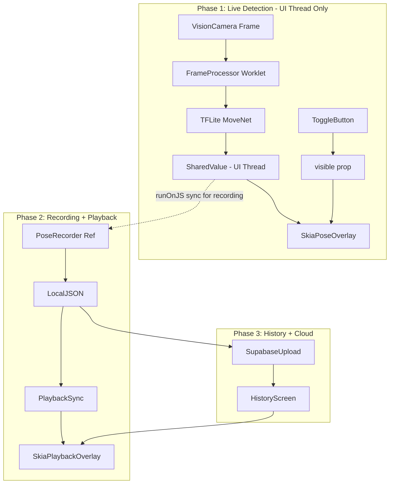

---

name: Native Pose Detection MVP Corrected

overview: Corrected phased implementation of real pose detection for native devices. Phase 1 uses SharedValue pattern (not Store) for zero-copy UI-thread rendering with platform-specific TFLite delegates. Phase 2 adds recording with Store sync. Phase 3 adds history with Supabase sync.

todos:

  - id: phase1-deps

content: Install fast-tflite@1.6.1, worklets-core@1.6.2, skia@2.2.10

status: pending

  - id: phase1-babel

content: Add worklets-core/plugin BEFORE reanimated/plugin in babel.config.js

status: pending

  - id: phase1-metro

content: "Add unstable_enablePackageExports: true to metro.config.js resolver"

status: pending

  - id: phase1-app-json

content: Add react-native-fast-tflite to app.json plugins array

status: pending

  - id: phase1-ios-verify

content: "CRITICAL: Run iOS build to verify tflite 1.6.1 + New Arch compatibility"

status: pending

  - id: phase1-model

content: Download and bundle movenet_lightning_int8.tflite

status: pending

  - id: phase1-hook

content: Replace MockMVPTFLiteModel with real TFLite + SharedValue pattern in useMVPPoseDetection.native.ts

status: pending

  - id: phase1-skia

content: Create SkiaPoseOverlay.native.tsx consuming SharedValue via useDerivedValue

status: pending

  - id: phase1-wire

content: Wire frameProcessor and SharedValue in CameraPreview.native.vision.tsx

status: pending

  - id: phase1-toggle

content: Uncomment toggle button and wire visible prop to overlay

status: pending

  - id: phase2-buffer

content: Add recording buffer Ref (NOT reactive state) for pose data during capture

status: pending

  - id: phase2-save

content: Save pose JSON alongside video in videoStorageService

status: pending

  - id: phase2-playback

content: Create PlaybackPoseOverlay synced to video currentTime

status: pending

  - id: phase2-shared

content: Refactor to shared SkeletonRenderer component

status: pending

  - id: phase3-cache

content: Create local pose data cache service

status: pending

  - id: phase3-supabase

content: Add Supabase storage integration for pose JSON

status: pending

  - id: phase3-sync

content: Implement background sync service

status: pending

---

# Native Pose Detection MVP - Corrected Architecture

## Critical Corrections Applied

This plan addresses the Principal Architect Review findings:

1. **SharedValue pattern** replaces PoseStore for live detection (fixes 67-136ms latency)
2. **Platform-specific delegates** (CoreML/NNAPI) replace GPU delegate
3. **Metro config** adds `unstable_enablePackageExports`
4. **Babel plugin ordering** explicitly documented
5. **iOS build verification** added as risk mitigation
6. **New Architecture clarification** - opt-in, not mandatory

---

## Corrected Architecture



**Key Difference:** Live detection (`D -> E`) stays entirely on UI thread via SharedValue. Store sync (`D -.-> H`) only runs during recording via `runOnJS` and writes to a Ref, not reactive state.

---

## Phase 1: Camera Live Detection (Corrected)

### 1.1 Install Dependencies

Add to [apps/expo/package.json](apps/expo/package.json):

```json
"react-native-fast-tflite": "^1.6.1",
"react-native-worklets-core": "^1.6.2",
"@shopify/react-native-skia": "^2.2.10"
```

### 1.2 Configure Babel Plugins (ORDER CRITICAL)

Update [apps/expo/babel.config.js](apps/expo/babel.config.js):

```javascript
plugins: [
  // module-resolver and tamagui plugins...
  
  // CRITICAL: worklets-core MUST come BEFORE reanimated
  'react-native-worklets-core/plugin',
  'react-native-reanimated/plugin',  // MUST be last
],
```

### 1.3 Configure Metro for Package Exports

Update [apps/expo/metro.config.js](apps/expo/metro.config.js):

```javascript
config.resolver = {
  ...config.resolver,
  unstable_enablePackageExports: true,  // Required for RN 0.79
}
```

### 1.4 Configure app.json Expo Plugin

Update [apps/expo/app.json](apps/expo/app.json):

```json
"plugins": [
  ["react-native-fast-tflite", {}],
  // ... existing plugins
]
```

### 1.5 Verify New Architecture Status

Check [apps/expo/app.json](apps/expo/app.json) - currently:

```json
"experiments": {
  "newArchEnabled": true  // Already enabled
}
```

Note: New Architecture is opt-in in RN 0.79, but Expo SDK 53 enables it by default. Current config is correct.

Commands:

```bash
yarn workspace expo-app add react-native-fast-tflite@^1.6.1 react-native-worklets-core@^1.6.2 @shopify/react-native-skia@^2.2.10
npx expo prebuild --clean
cd apps/expo && npx pod-install
```

### 1.6 Download and Bundle MoveNet Model

- Download `movenet_lightning_int8.tflite` from TensorFlow Hub
- Place in `apps/expo/assets/models/movenet_lightning_int8.tflite`

### 1.7 Replace Mock with Real TFLite + SharedValue

File: [packages/app/features/CameraRecording/hooks/useMVPPoseDetection.native.ts](packages/app/features/CameraRecording/hooks/useMVPPoseDetection.native.ts)

```typescript
import { useTensorflowModel } from 'react-native-fast-tflite'
import { useSharedValue } from 'react-native-worklets-core'
import { useFrameProcessor } from 'react-native-vision-camera'
import { Platform } from 'react-native'
import type { MVPPoseDetectionResult } from '../types/MVPpose'

export const useMVPPoseDetection = () => {
  // SharedValue - stays on UI thread, no JS bridge crossing
  const currentPose = useSharedValue<MVPPoseDetectionResult | null>(null)
  
  const model = useTensorflowModel({
    modelPath: require('../../../assets/models/movenet_lightning_int8.tflite'),
    // Platform-specific delegates (NOT 'gpu')
    delegate: Platform.select({
      ios: 'coreml',      // Apple Neural Engine
      android: 'nnapi',   // Auto-selects GPU/DSP/NPU
      default: 'cpu',
    }),
    threads: 4,
  })

  const frameProcessor = useFrameProcessor((frame) => {
    'worklet'
    if (model.state !== 'loaded') return
    
    const outputs = model.model.runSync([frame])
    const keypointsRaw = outputs[0]
    const keypoints = []
    
    for (let i = 0; i < 51; i += 3) {
      keypoints.push({
        y: keypointsRaw[i] * frame.height,
        x: keypointsRaw[i + 1] * frame.width,
        score: keypointsRaw[i + 2],
      })
    }
    
    // Direct write to SharedValue (no bridge, no store)
    currentPose.value = { keypoints, timestamp: Date.now() }
  }, [model])

  return { frameProcessor, currentPose, isModelLoaded: model.state === 'loaded' }
}
```

### 1.8 Create Skia Pose Overlay (SharedValue Consumer)

New file: `packages/ui/src/components/CameraRecording/PoseOverlay/SkiaPoseOverlay.native.tsx`

```typescript
import React from 'react'
import { StyleSheet, useWindowDimensions } from 'react-native'
import { Canvas, Circle, Line, vec } from '@shopify/react-native-skia'
import { useDerivedValue } from 'react-native-reanimated'
import type { SharedValue } from 'react-native-worklets-core'
import type { MVPPoseDetectionResult } from '../../../hooks/useMVPPoseDetection'

interface Props {
  poseSharedValue: SharedValue<MVPPoseDetectionResult | null>
  visible: boolean
}

// MoveNet 17 keypoint connections
const SKELETON_CONNECTIONS = [
  [0, 1], [0, 2], [1, 3], [2, 4], [5, 6], [5, 7], [7, 9], [6, 8], 
  [8, 10], [5, 11], [6, 12], [11, 12], [11, 13], [13, 15], [12, 14], [14, 16]
]

export const SkiaPoseOverlay: React.FC<Props> = ({ poseSharedValue, visible }) => {
  // NOTE: In production, consider passing frame dimensions for accurate scaling
  // vs screen dimensions if aspect ratios differ
  const { width, height } = useWindowDimensions();

  // useDerivedValue runs on UI thread
  const keypoints = useDerivedValue(() => {
    const pose = poseSharedValue.value
    if (!pose || !visible) return []
    return pose.keypoints.filter(kp => kp.score > 0.3)
  }, [poseSharedValue, visible])
  
  const lines = useDerivedValue(() => {
    const pose = poseSharedValue.value
    if (!pose || !visible) return []
    
    return SKELETON_CONNECTIONS
      .map(([startIdx, endIdx]) => {
        const start = pose.keypoints[startIdx]
        const end = pose.keypoints[endIdx]
        if (start.score > 0.3 && end.score > 0.3) {
          return { p1: vec(start.x, start.y), p2: vec(end.x, end.y) }
        }
        return null
      })
      .filter(Boolean)
  }, [poseSharedValue, visible])

  if (!visible) return null

  return (
    <Canvas style={StyleSheet.absoluteFill} pointerEvents="none">
      {lines.value.map((line, i) => (
        <Line key={`line-${i}`} p1={line.p1} p2={line.p2} color="cyan" strokeWidth={2} />
      ))}
      {keypoints.value.map((point, i) => (
        <Circle key={`point-${i}`} cx={point.x} cy={point.y} r={point.score > 0.5 ? 6 : 3} color={point.score > 0.5 ? 'lime' : 'yellow'} />
      ))}
    </Canvas>
  )
}
```

### 1.9 Wire Frame Processor + Overlay

File: [packages/ui/src/components/CameraRecording/CameraPreview/CameraPreview.native.vision.tsx](packages/ui/src/components/CameraRecording/CameraPreview/CameraPreview.native.vision.tsx)

- Import and use `useMVPPoseDetection` hook
- Pass `frameProcessor` to `<Camera>` component
- Pass `currentPose` SharedValue to `<SkiaPoseOverlay>`
- Pass `visible` from toggle state

### 1.10 Uncomment Toggle UI

File: [packages/app/features/CameraRecording/CameraRecordingScreen.vision.tsx](packages/app/features/CameraRecording/CameraRecordingScreen.vision.tsx)

- Uncomment `PoseDetectionToggleCompact` import
- Uncomment `useMVPPoseToggle` hook
- Wire toggle state to overlay `visible` prop

---

## Phase 2: Playback Overlay (Store Only for Recording)

### 2.1 Add Recording Buffer (NOT Live State)

File: [packages/app/stores/MVPposeStore.ts](packages/app/stores/MVPposeStore.ts)

Only use store for recording purposes, never for live rendering:

```typescript
interface RecordingBuffer {
  poses: Map<number, MVPPoseDetectionResult>
  videoId: string
  startTime: number
}

// Use a Ref pattern during recording
const recordingBufferRef = useRef<RecordingBuffer | null>(null)

// Sync from SharedValue via runOnJS (only during recording)
const syncToBuffer = useCallback((pose: MVPPoseDetectionResult) => {
  if (recordingBufferRef.current) {
    const relativeTime = pose.timestamp - recordingBufferRef.current.startTime
    recordingBufferRef.current.poses.set(relativeTime, pose)
  }
}, [])
```

### 2.2 Save Pose JSON with Video

- Export buffer to JSON when recording stops
- Save as `{videoId}_poses.json`
- Store in app documents directory

### 2.3 Create Playback Pose Overlay

- Load pose JSON when video loads
- Find pose frame closest to `currentTime`
- Render using shared Skia drawing logic

### 2.4 Shared Skeleton Renderer

Refactor to share drawing logic:

```
packages/ui/src/components/PoseOverlay/
├── SkeletonRenderer.tsx       # Shared drawing logic
├── LivePoseOverlay.native.tsx # SharedValue consumer
├── PlaybackPoseOverlay.tsx    # JSON data consumer
└── index.ts
```

---

## Phase 3: History + Supabase Sync

### 3.1 Local Pose Data Cache

- Store pose JSON in app documents directory
- Track sync status per video

### 3.2 Supabase Storage Integration

```
storage/
├── raw/{userId}/{videoId}.mp4
├── poses/{userId}/{videoId}_poses.json
```

### 3.3 Background Sync Service

- Queue upload on recording complete
- Sync pending on app launch
- Download on history view if not cached

---

## Risk Mitigation (Updated)

| Risk | Mitigation |

|------|------------|

| iOS build failure with tflite 1.6.1 + New Arch | **IMMEDIATE: Run iOS build after install. Fallback to v1.5.1 or disable New Arch for iOS if fails** |

| Metro cache stale after JSI upgrade | Run `npx expo prebuild --clean` after every JSI package change |

| TFLite model slow on low-end devices | Use Lightning model + frame skip if FPS drops below 20 |

| Babel plugin order wrong | Verify worklets-core/plugin is BEFORE reanimated/plugin |

| SharedValue not syncing to Skia | Verify useDerivedValue dependencies include SharedValue |

---

## Compatibility Notes (Corrected)

- **New Architecture**: Opt-in in RN 0.79, enabled by default in Expo SDK 53. Current config is correct.
- **Skia v2**: Works with both Legacy and New Architecture. Does NOT require Bridgeless.
- **worklets-core 1.6.2**: Correct package for VisionCamera (not Software Mansion's `react-native-worklets`)
- **Delegates**: CoreML (iOS) and NNAPI (Android) have native int8 support. GPU delegate works but has I/O overhead.

```