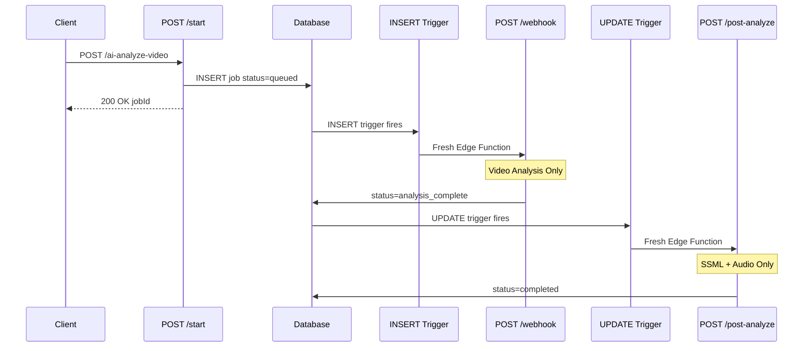

# Split Pipeline Architecture

## Problem Summary

Video analysis stalls at 55% because `processAIPipeline()` runs SSML/Audio as a background promise. When wall clock timeout hits (~150s), the entire Edge Function dies silently, orphaning the job.

## Solution Architecture



## Implementation Plan

### Phase 1: Database Migration

**File**: `supabase/migrations/YYYYMMDDHHMMSS_split_pipeline_triggers.sql`

- Drop and recreate `analysis_jobs_status_check` constraint to include `analysis_complete`
- Create `auto_start_post_analysis` UPDATE trigger that fires when `status` transitions to `analysis_complete`
- Trigger calls `/ai-analyze-video/post-analyze` with webhook secret

Key SQL:

```sql
ALTER TABLE public.analysis_jobs 
  DROP CONSTRAINT IF EXISTS analysis_jobs_status_check;

ALTER TABLE public.analysis_jobs 
  ADD CONSTRAINT analysis_jobs_status_check 
  CHECK (status = ANY (ARRAY['queued', 'processing', 'analysis_complete', 'completed', 'failed']::text[]));

CREATE TRIGGER auto_start_post_analysis
  AFTER UPDATE ON public.analysis_jobs
  FOR EACH ROW
  WHEN (OLD.status IS DISTINCT FROM NEW.status AND NEW.status = 'analysis_complete')
  EXECUTE FUNCTION supabase_functions.http_request(
    'https://qbkvqhoijishdkqlwhqp.supabase.co/functions/v1/ai-analyze-video/post-analyze',
    'POST', '{"Content-Type":"application/json","X-Db-Webhook-Secret":"..."}', '{}', '5000'
  );
```

### Phase 2: Add Gemini Timeout

**File**: [`supabase/functions/_shared/gemini/generate.ts`](supabase/functions/_shared/gemini/generate.ts)

Add `AbortController` with 120s timeout to `generateContent()` fetch call (line 66):

- Define `GEMINI_TIMEOUT_MS = 120_000`
- Create `AbortController`, set timeout with `setTimeout()`
- Pass `signal: controller.signal` to fetch
- Handle `AbortError` in catch block

### Phase 3: Modify /start Route

**File**: [`supabase/functions/ai-analyze-video/routes/handleStartAnalysis.ts`](supabase/functions/ai-analyze-video/routes/handleStartAnalysis.ts)

Remove the `processAIPipeline()` call (lines 167-193). The INSERT trigger handles starting the pipeline via `/webhook`. This eliminates the dual-path redundancy.

### Phase 4: Modify aiPipeline for Video-Only

**File**: [`supabase/functions/_shared/pipeline/aiPipeline.ts`](supabase/functions/_shared/pipeline/aiPipeline.ts)

- Change completion status from `completed` to `analysis_complete` at 80% (line 272)
- Remove the fire-and-forget SSML/Audio block (lines 277-368)
- Add log indicating SSML/Audio triggered by UPDATE webhook

### Phase 5: Create /post-analyze Route

**File**: `supabase/functions/ai-analyze-video/routes/handlePostAnalyze.ts` (new)

Create handler that:

- Validates `X-Db-Webhook-Secret` header
- Parses job ID from webhook payload (`body.record.id`)
- Fetches analysis UUID and feedback IDs
- Calls `processSSMLJobs()` synchronously
- Calls `processAudioJobs()` if SSML succeeds
- Updates status to `completed` at 100%

### Phase 6: Update Route Registration

**File**: [`supabase/functions/ai-analyze-video/index.ts`](supabase/functions/ai-analyze-video/index.ts)

Add route for `POST /ai-analyze-video/post-analyze` that calls `handlePostAnalyze()`.

### Phase 7: Update Zod Schema

**File**: [`packages/api/src/validation/cameraRecordingSchemas.ts`](packages/api/src/validation/cameraRecordingSchemas.ts)

Add `analysis_complete` to `AnalysisStatusSchema` enum (line 15).

### Phase 8: Update TypeScript Types

**File**: [`supabase/functions/_shared/types/ai-analyze-video.ts`](supabase/functions/_shared/types/ai-analyze-video.ts)

Add `analysis_complete` to `AnalysisJob.status` union type (line 66).

### Phase 9: Update Frontend Status Mapping

**File**: [`packages/app/features/VideoAnalysis/hooks/useAnalysisState.ts`](packages/app/features/VideoAnalysis/hooks/useAnalysisState.ts)

In `deriveAnalysisStatus()` and `determinePhase()`:

- Map `analysis_complete` to `generating-feedback` phase
- UI continues showing step 2 while SSML/Audio processes

## Files Summary

| File | Action |

|------|--------|

| `supabase/migrations/YYYYMMDD_split_pipeline.sql` | Create |

| `supabase/functions/_shared/gemini/generate.ts` | Modify |

| `supabase/functions/ai-analyze-video/routes/handleStartAnalysis.ts` | Modify |

| `supabase/functions/_shared/pipeline/aiPipeline.ts` | Modify |

| `supabase/functions/ai-analyze-video/routes/handlePostAnalyze.ts` | Create |

| `supabase/functions/ai-analyze-video/index.ts` | Modify |

| `packages/api/src/validation/cameraRecordingSchemas.ts` | Modify |

| `supabase/functions/_shared/types/ai-analyze-video.ts` | Modify |

| `packages/app/features/VideoAnalysis/hooks/useAnalysisState.ts` | Modify |

## Definition of Done

- Migration applied and verified in Supabase Studio
- `generateContent()` aborts after 120s with clear error
- `/start` only creates job, returns immediately
- `/webhook` runs video analysis only, sets `analysis_complete`
- UPDATE trigger fires when status = `analysis_complete`
- `/post-analyze` processes SSML + Audio, sets `completed`
- Zod and TypeScript types include `analysis_complete`
- UI shows correct phase for `analysis_complete` status
- All quality gates pass: `yarn type-check`, `yarn lint`