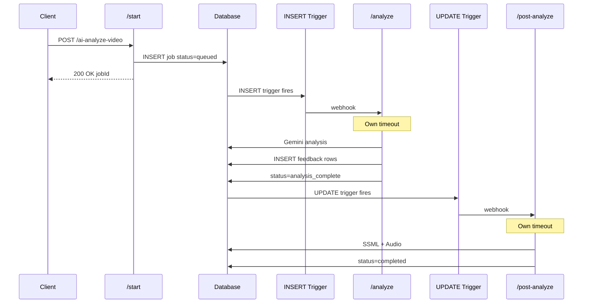

# Split Pipeline Architecture

## Problem

Video analysis gets stuck at 55% because `processAIPipeline` runs as a background promise within a single Edge Function invocation. When the wall clock timeout hits, the entire function dies silently.

## Solution

Split the pipeline into separate Edge Function invocations, each triggered by database state changes:

## Changes Required

### 1. Database Migration

Add new status value and UPDATE trigger:

- Add `analysis_complete` to `analysis_jobs.status` CHECK constraint
- Create UPDATE trigger that fires when `status` changes to `analysis_complete`
- Trigger calls `/post-analyze` endpoint via `supabase_functions.http_request`

### 2. Modify /start Route

File: [`supabase/functions/ai-analyze-video/routes/handleStartAnalysis.ts`](supabase/functions/ai-analyze-video/routes/handleStartAnalysis.ts)

- Remove `processAIPipeline()` call entirely
- Only: validate input, create job, return immediately
- The INSERT trigger will fire the webhook to `/analyze`

### 3. Modify /analyze Route (currently /webhook)

File: [`supabase/functions/ai-analyze-video/routes/handleWebhookStart.ts`](supabase/functions/ai-analyze-video/routes/handleWebhookStart.ts)

- Rename to `handleAnalyze.ts` for clarity
- Video analysis ONLY (no SSML/Audio)
- On success: set `status = 'analysis_complete'` (not `completed`)
- On failure: set `status = 'failed'`
- Remove fire-and-forget SSML/Audio calls from `aiPipeline.ts`

### 4. Create /post-analyze Route

New file: `supabase/functions/ai-analyze-video/routes/handlePostAnalyze.ts`

- Triggered by UPDATE trigger when `status = 'analysis_complete'`
- Query `analysis_feedback WHERE ssml_status = 'queued'`
- Run SSML worker, then Audio worker
- On completion: set `status = 'completed'`

### 5. Add Timeout to Gemini Call

File: [`supabase/functions/_shared/gemini/generate.ts`](supabase/functions/_shared/gemini/generate.ts)

- Add `AbortController` with 120s timeout
- Log before/after `generateContent()` call for debugging
- Proper error handling for timeout

### 6. Update Route Registration

File: [`supabase/functions/ai-analyze-video/index.ts`](supabase/functions/ai-analyze-video/index.ts)

- Add route: `POST /ai-analyze-video/post-analyze`
- Optionally rename `/webhook` to `/analyze` for clarity

### 7. Frontend Consideration

File: [`packages/app/features/VideoAnalysis/components/ProcessingIndicator.tsx`](packages/app/features/VideoAnalysis/components/ProcessingIndicator.tsx)

- `analysis_complete` status should be treated as "processing" (step 2: Analyzing)
- No UI changes needed if we map it to existing phase

## File Summary

| File | Action |

|------|--------|

| `supabase/migrations/YYYYMMDD_split_pipeline.sql` | New migration |

| `handleStartAnalysis.ts` | Modify - remove pipeline call |

| `handleWebhookStart.ts` | Rename to `handleAnalyze.ts`, modify |

| `handlePostAnalyze.ts` | New file |

| `aiPipeline.ts` | Modify - remove SSML/Audio calls |

| `generate.ts` | Add timeout |

| `index.ts` | Add route |