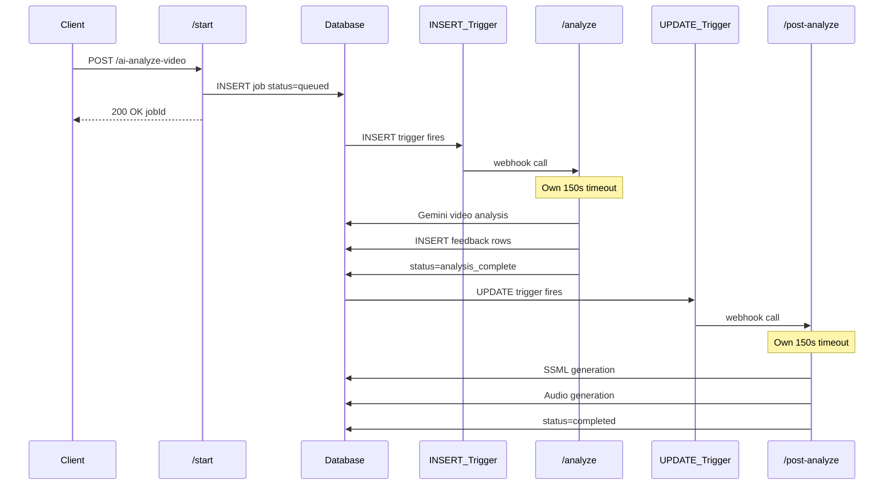

# Split Pipeline Architecture

## Problem

Video analysis gets stuck at 55% because `processAIPipeline` runs as a background promise within a single Edge Function invocation. When the wall clock timeout hits (~60-150s), the entire function dies silently - no error logged, no status update, DB shows `processing 55%` forever.

## Solution

Split the pipeline into separate Edge Function invocations, each triggered by database state changes:



---

## Phase 1: Database Migration

Create migration: `supabase/migrations/YYYYMMDDHHMMSS_split_pipeline_triggers.sql`

### Changes:

1. Add `analysis_complete` to status CHECK constraint:
```sql
ALTER TABLE public.analysis_jobs 
DROP CONSTRAINT IF EXISTS analysis_jobs_status_check;

ALTER TABLE public.analysis_jobs 
ADD CONSTRAINT analysis_jobs_status_check 
CHECK (status = ANY (ARRAY['queued', 'processing', 'analysis_complete', 'completed', 'failed']));
```

2. Create UPDATE trigger for `analysis_complete`:
```sql
CREATE OR REPLACE TRIGGER auto_start_post_analysis
AFTER UPDATE ON public.analysis_jobs
FOR EACH ROW
WHEN (OLD.status IS DISTINCT FROM NEW.status AND NEW.status = 'analysis_complete')
EXECUTE FUNCTION supabase_functions.http_request(
  'https://YOUR_PROJECT.supabase.co/functions/v1/ai-analyze-video/post-analyze',
  'POST',
  '{"Content-Type":"application/json","X-Db-Webhook-Secret":"..."}',
  '{}',
  '5000'
);
```


---

## Phase 2: Add Timeout to Gemini Call

File: [`supabase/functions/_shared/gemini/generate.ts`](supabase/functions/_shared/gemini/generate.ts)

### Changes:

1. Add `AbortController` with 120s timeout to `generateContent()` fetch
2. Log before/after the Gemini call for debugging
3. Handle `AbortError` and convert to descriptive error message
```typescript
const GEMINI_TIMEOUT_MS = 120_000

const controller = new AbortController()
const timeoutId = setTimeout(() => controller.abort(), GEMINI_TIMEOUT_MS)

try {
  dbLogger?.info('Starting Gemini inference', { fileName: request.fileRef.name })
  
  const response = await fetch(url, {
    method: 'POST',
    headers: {...},
    body: JSON.stringify(requestBody),
    signal: controller.signal
  })
  
  clearTimeout(timeoutId)
  // ... existing logic
} catch (error) {
  clearTimeout(timeoutId)
  if (error instanceof Error && error.name === 'AbortError') {
    throw new Error(`Gemini API timeout after ${GEMINI_TIMEOUT_MS / 1000}s`)
  }
  throw error
}
```


---

## Phase 3: Modify /start Route

File: [`supabase/functions/ai-analyze-video/routes/handleStartAnalysis.ts`](supabase/functions/ai-analyze-video/routes/handleStartAnalysis.ts)

### Changes:

1. **Remove** the `processAIPipeline()` call (lines 168-193)
2. Only: validate input, create job (status=queued), return immediately
3. The INSERT trigger will fire the webhook to `/analyze`

**Before:**

```typescript
processAIPipeline({...}).catch(...)
return new Response(...)
```

**After:**

```typescript
// Pipeline triggered by INSERT webhook - no direct call needed
return new Response(
  JSON.stringify({
    analysisId: analysisJob.id,
    status: 'queued',
    message: 'Analysis job created, processing will start automatically',
  }),
  { headers: {...}, status: 200 }
)
```

---

## Phase 4: Modify aiPipeline for Video-Only

File: [`supabase/functions/_shared/pipeline/aiPipeline.ts`](supabase/functions/_shared/pipeline/aiPipeline.ts)

### Changes:

1. After video analysis completes, set status to `analysis_complete` (not `completed`)
2. **Remove** the fire-and-forget SSML/Audio calls (lines 277-368)
3. Return `feedbackIds` for verification

**Key change at line 272:**

```typescript
// Mark analysis job as analysis_complete (video analysis done, feedback items available)
// SSML/Audio will be triggered by separate UPDATE webhook
await updateAnalysisStatus(supabase, analysisId, 'analysis_complete', null, 75, logger)
await notifyAnalysisComplete(analysisId, logger)

// NO SSML/Audio here - handled by /post-analyze triggered by UPDATE webhook
return
```

---

## Phase 5: Create /post-analyze Route

New file: `supabase/functions/ai-analyze-video/routes/handlePostAnalyze.ts`

### Responsibilities:

1. Validate webhook secret
2. Extract jobId from payload
3. Query `analysis_feedback WHERE ssml_status = 'queued'` for the job
4. Run SSML worker
5. Run Audio worker
6. Set status to `completed`
```typescript
export async function handlePostAnalyze({ req, supabase, logger }: HandlerContext): Promise<Response> {
  // Validate secret
  // Extract jobId from body.record.id (DB webhook format)
  // Query feedbackIds: SELECT id FROM analysis_feedback WHERE analysis_id = ... AND ssml_status = 'queued'
  // Call processSSMLJobs() - AWAIT (blocking)
  // Call processAudioJobs() - AWAIT (blocking)
  // Update status to 'completed'
  return new Response(JSON.stringify({ status: 'completed' }), {...})
}
```


---

## Phase 6: Update Route Registration

File: [`supabase/functions/ai-analyze-video/index.ts`](supabase/functions/ai-analyze-video/index.ts)

### Changes:

1. Import `handlePostAnalyze`
2. Add route: `POST /ai-analyze-video/post-analyze`
```typescript
import { handlePostAnalyze } from './routes/handlePostAnalyze.ts'

// Route: POST /ai-analyze-video/post-analyze - SSML + Audio (triggered by UPDATE webhook)
if (req.method === 'POST' && path === '/ai-analyze-video/post-analyze') {
  return handlePostAnalyze({ req, supabase, logger })
}
```


---

## Phase 7: Update Status Mapping (Frontend)

File: [`packages/app/features/VideoAnalysis/hooks/useAnalysisState.ts`](packages/app/features/VideoAnalysis/hooks/useAnalysisState.ts)

### Changes:

Map `analysis_complete` to `generating-feedback` phase for UI:

```typescript
function mapStatusToPhase(status: string): AnalysisPhase {
  switch (status) {
    case 'queued': return 'uploading'
    case 'processing': return 'analyzing'
    case 'analysis_complete': return 'generating-feedback'  // NEW
    case 'completed': return 'ready'
    case 'failed': return 'error'
    default: return 'analyzing'
  }
}
```

---

## Definition of Done

- [ ] Migration applied: `analysis_complete` status and UPDATE trigger work
- [ ] Timeout: `generateContent()` aborts after 120s with clear error
- [ ] `/start`: Only creates job, returns immediately
- [ ] `/analyze` (webhook): Video analysis only, sets `analysis_complete`
- [ ] `/post-analyze`: SSML + Audio, sets `completed`
- [ ] Routes registered in index.ts
- [ ] UI maps `analysis_complete` to correct phase
- [ ] All quality gates pass: type-check, lint, tests

---

## Files to Modify

| File | Action |

|------|--------|

| `supabase/migrations/YYYYMMDD_split_pipeline.sql` | **Create** - migration |

| `supabase/functions/_shared/gemini/generate.ts` | **Modify** - add timeout |

| `supabase/functions/ai-analyze-video/routes/handleStartAnalysis.ts` | **Modify** - remove pipeline call |

| `supabase/functions/_shared/pipeline/aiPipeline.ts` | **Modify** - video-only, remove SSML/Audio |

| `supabase/functions/ai-analyze-video/routes/handlePostAnalyze.ts` | **Create** - new route |

| `supabase/functions/ai-analyze-video/index.ts` | **Modify** - add route |

| `packages/app/features/VideoAnalysis/hooks/useAnalysisState.ts` | **Modify** - status mapping |