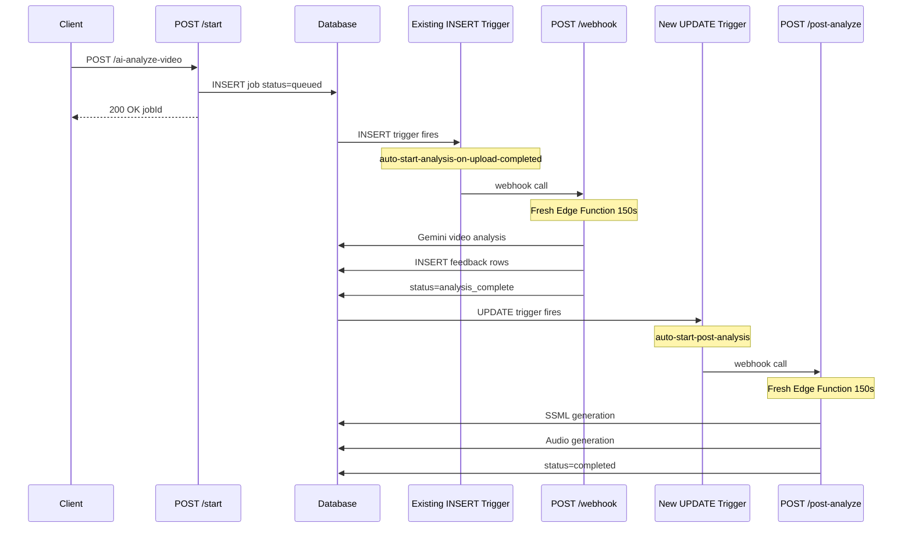

# Split Pipeline Architecture v2

## Problem

Video analysis gets stuck at 55% because `processAIPipeline` runs as a background promise within a single Edge Function invocation. When the wall clock timeout hits, the entire function dies silently.

## Solution

Split the pipeline into two Edge Function invocations triggered by database state changes:



---

## Existing State (Important Clarifications)

### INSERT Trigger Already Exists

The trigger `auto-start-analysis-on-upload-completed` already exists and fires on `analysis_jobs INSERT`:

```sql
CREATE TRIGGER "auto-start-analysis-on-upload-completed" 
AFTER INSERT ON public.analysis_jobs 
FOR EACH ROW 
EXECUTE FUNCTION supabase_functions.http_request(
  'https://qbkvqhoijishdkqlwhqp.supabase.co/functions/v1/ai-analyze-video',
  'POST', ...
);
```

This calls `/ai-analyze-video` which routes to `handleWebhookStart.ts` (via X-Db-Webhook-Secret header check).

### Current Dual-Path Issue

Currently BOTH paths start the full pipeline:

- `handleStartAnalysis.ts` line 168: calls `processAIPipeline()` directly
- `handleWebhookStart.ts` line 149: calls `processAIPipeline()` via INSERT trigger

The webhook check (`status !== 'queued'`) prevents double-processing, but the architecture is redundant.

---

## Phase 1: Database Migration

**File:** `supabase/migrations/YYYYMMDDHHMMSS_split_pipeline_triggers.sql`

### 1.1 Add `analysis_complete` status

```sql
-- Drop and recreate CHECK constraint with new status
ALTER TABLE public.analysis_jobs 
DROP CONSTRAINT IF EXISTS analysis_jobs_status_check;

ALTER TABLE public.analysis_jobs 
ADD CONSTRAINT analysis_jobs_status_check 
CHECK (status = ANY (ARRAY[
  'queued'::text, 
  'processing'::text, 
  'analysis_complete'::text,  -- NEW
  'completed'::text, 
  'failed'::text
]));
```

### 1.2 Create UPDATE trigger for post-analysis

```sql
CREATE OR REPLACE TRIGGER auto_start_post_analysis
AFTER UPDATE ON public.analysis_jobs
FOR EACH ROW
WHEN (
  OLD.status IS DISTINCT FROM NEW.status 
  AND NEW.status = 'analysis_complete'
)
EXECUTE FUNCTION supabase_functions.http_request(
  'https://qbkvqhoijishdkqlwhqp.supabase.co/functions/v1/ai-analyze-video/post-analyze',
  'POST',
  '{"Content-Type":"application/json","X-Db-Webhook-Secret":"YOUR_SECRET"}',
  '{}',
  '5000'
);
```

---

## Phase 2: Add Timeout to Gemini Call

**File:** [`supabase/functions/_shared/gemini/generate.ts`](supabase/functions/_shared/gemini/generate.ts)

Add `AbortController` with 120s timeout to the `generateContent()` fetch call (line 66):

```typescript
const GEMINI_TIMEOUT_MS = 120_000  // 120 seconds

export async function generateContent(
  request: GenerateRequest,
  config: GeminiConfig,
  dbLogger?: DatabaseLogger
): Promise<...> {
  // ... existing setup ...

  const controller = new AbortController()
  const timeoutId = setTimeout(() => {
    controller.abort()
    dbLogger?.error('Gemini API timeout - aborting request', {
      fileName: request.fileRef.name,
      timeoutMs: GEMINI_TIMEOUT_MS
    })
  }, GEMINI_TIMEOUT_MS)

  try {
    dbLogger?.info('Starting Gemini inference request', { 
      fileName: request.fileRef.name 
    })
    
    const response = await fetch(`${config.mmGenerateUrl}?key=${config.apiKey}`, {
      method: 'POST',
      headers: { 'Content-Type': 'application/json' },
      body: JSON.stringify(requestBody),
      signal: controller.signal  // ADD THIS
    })

    clearTimeout(timeoutId)
    // ... existing response handling ...
    
  } catch (error) {
    clearTimeout(timeoutId)
    
    if (error instanceof Error && error.name === 'AbortError') {
      const msg = `Gemini API timeout after ${GEMINI_TIMEOUT_MS / 1000}s`
      dbLogger?.error(msg, { fileName: request.fileRef.name })
      throw new Error(msg)
    }
    throw error
  }
}
```

---

## Phase 3: Modify /start Route

**File:** [`supabase/functions/ai-analyze-video/routes/handleStartAnalysis.ts`](supabase/functions/ai-analyze-video/routes/handleStartAnalysis.ts)

Remove the `processAIPipeline()` call entirely (lines 168-193). The INSERT trigger will handle starting the pipeline.

**Before (lines 167-205):**

```typescript
// Start AI pipeline processing in background
processAIPipeline({...}).catch(...)

return new Response(
  JSON.stringify({
    analysisId: analysisJob.id,
    status: 'queued',
    message: 'Analysis job created successfully',
  }),
  {...}
)
```

**After:**

```typescript
// Pipeline is triggered automatically by INSERT webhook
// No direct processAIPipeline() call needed

logger.info('Analysis job created, INSERT trigger will start pipeline', { 
  analysisId: analysisJob.id 
})

return new Response(
  JSON.stringify({
    analysisId: analysisJob.id,
    status: 'queued',
    message: 'Analysis job created, processing will start automatically',
  }),
  {
    headers: { ...corsHeaders, 'Content-Type': 'application/json' },
    status: 200,
  }
)
```

---

## Phase 4: Modify aiPipeline for Video-Only

**File:** [`supabase/functions/_shared/pipeline/aiPipeline.ts`](supabase/functions/_shared/pipeline/aiPipeline.ts)

### 4.1 Change completion status (line 272)

**Before:**

```typescript
await updateAnalysisStatus(supabase, analysisId, 'completed', null, 100, logger)
```

**After:**

```typescript
// Mark as analysis_complete - SSML/Audio triggered by UPDATE webhook
await updateAnalysisStatus(supabase, analysisId, 'analysis_complete', null, 80, logger)
```

### 4.2 Remove SSML/Audio fire-and-forget (lines 277-368)

Delete or comment out the entire block:

```typescript
// REMOVED: SSML/Audio now handled by /post-analyze endpoint
// if (Array.isArray(feedbackIds) && feedbackIds.length > 0) {
//   if (stages.runSSML) {
//     processSSMLJobs({...}).then(...)
//   }
// }
```

Replace with:

```typescript
// SSML/Audio processing is triggered by UPDATE webhook when status = 'analysis_complete'
// See /post-analyze endpoint (handlePostAnalyze.ts)
logger.info('Video analysis complete, SSML/Audio will be triggered by UPDATE webhook', {
  analysisId,
  feedbackIds: feedbackIds?.length || 0
})

return
```

---

## Phase 5: Create /post-analyze Route

**New File:** `supabase/functions/ai-analyze-video/routes/handlePostAnalyze.ts`

```typescript
import { corsHeaders } from '../../_shared/http/cors.ts'
import { createErrorResponse } from '../../_shared/http/responses.ts'
import { updateAnalysisStatus } from '../../_shared/db/analysis.ts'
import { processSSMLJobs } from '../workers/ssmlWorker.ts'
import { processAudioJobs } from '../workers/audioWorker.ts'

interface HandlerContext {
  req: Request
  supabase: any
  logger: { info: (msg: string, data?: any) => void; error: (msg: string, data?: any) => void }
}

export async function handlePostAnalyze({ req, supabase, logger }: HandlerContext): Promise<Response> {
  try {
    // Validate webhook secret
    const provided = req.headers.get('X-Db-Webhook-Secret') || ''
    const expected = Deno.env.get('DB_WEBHOOK_SECRET') || Deno.env.get('EDGE_DB_WEBHOOK_SECRET')

    if (!expected || provided !== expected) {
      logger.error('Post-analyze webhook unauthorized')
      return createErrorResponse('Unauthorized', 401)
    }

    // Parse payload - DB webhook sends { record: { id, ... } }
    let jobId: number | undefined
    try {
      const body = await req.json()
      jobId = body?.record?.id || body?.analysisJobId
    } catch {
      return createErrorResponse('Invalid payload', 400)
    }

    if (!jobId) {
      return createErrorResponse('Missing job ID', 400)
    }

    logger.info('Post-analyze webhook received', { jobId })

    // Get analysis UUID and feedback IDs for this job
    const { data: analysis, error: analysisError } = await supabase
      .from('analyses')
      .select('id')
      .eq('job_id', jobId)
      .single()

    if (analysisError || !analysis) {
      logger.error('Analysis not found for job', { jobId, error: analysisError })
      return createErrorResponse('Analysis not found', 404)
    }

    // Get feedback items that need SSML processing
    const { data: feedbackItems, error: feedbackError } = await supabase
      .from('analysis_feedback')
      .select('id')
      .eq('analysis_id', analysis.id)
      .eq('ssml_status', 'queued')

    if (feedbackError) {
      logger.error('Failed to fetch feedback items', { error: feedbackError })
      return createErrorResponse('Failed to fetch feedback', 500)
    }

    const feedbackIds = feedbackItems?.map((f: { id: number }) => f.id) || []

    if (feedbackIds.length === 0) {
      logger.info('No feedback items to process', { jobId })
      await updateAnalysisStatus(supabase, jobId, 'completed', null, 100, logger)
      return new Response(JSON.stringify({ status: 'completed', message: 'No feedback to process' }), {
        headers: { ...corsHeaders, 'Content-Type': 'application/json' },
        status: 200
      })
    }

    logger.info('Processing SSML/Audio for feedback items', { jobId, count: feedbackIds.length })

    // Create DB logger for detailed logging
    const { createDatabaseLogger } = await import('../../_shared/db/logging.ts')
    const dbLogger = createDatabaseLogger('ai-analyze-video', 'post-analyze', supabase, {
      jobId,
      analysisId: analysis.id,
    })

    // Process SSML (blocking)
    const ssmlLogger = dbLogger.child('ssml-worker')
    const ssmlResult = await processSSMLJobs({ 
      supabase, 
      logger: ssmlLogger, 
      feedbackIds, 
      analysisId: analysis.id 
    })

    // Process Audio if SSML succeeded
    if (ssmlResult.errors === 0) {
      const audioLogger = dbLogger.child('audio-worker')
      await processAudioJobs({ 
        supabase, 
        logger: audioLogger, 
        feedbackIds, 
        analysisId: analysis.id,
        startTime: Date.now()
      })
    } else {
      logger.error('SSML processing had errors, skipping audio', { 
        errors: ssmlResult.errors 
      })
    }

    // Mark job as completed
    await updateAnalysisStatus(supabase, jobId, 'completed', null, 100, logger)

    return new Response(JSON.stringify({ 
      status: 'completed',
      feedbackProcessed: feedbackIds.length 
    }), {
      headers: { ...corsHeaders, 'Content-Type': 'application/json' },
      status: 200
    })

  } catch (error) {
    logger.error('Post-analyze failed', error)
    return createErrorResponse('Post-analyze failed', 500)
  }
}
```

---

## Phase 6: Update Route Registration

**File:** [`supabase/functions/ai-analyze-video/index.ts`](supabase/functions/ai-analyze-video/index.ts)

Add import and route:

```typescript
import { handlePostAnalyze } from './routes/handlePostAnalyze.ts'

// ... in Deno.serve handler ...

// Route: POST /ai-analyze-video/post-analyze - SSML + Audio (triggered by UPDATE webhook)
if (req.method === 'POST' && path === '/ai-analyze-video/post-analyze') {
  return handlePostAnalyze({ req, supabase, logger })
}
```

---

## Phase 7: Update Zod Schema

**File:** [`packages/api/src/validation/cameraRecordingSchemas.ts`](packages/api/src/validation/cameraRecordingSchemas.ts)

Update line 15:

**Before:**

```typescript
export const AnalysisStatusSchema = z.enum(['queued', 'processing', 'completed', 'failed'])
```

**After:**

```typescript
export const AnalysisStatusSchema = z.enum(['queued', 'processing', 'analysis_complete', 'completed', 'failed'])
```

---

## Phase 8: Update TypeScript Types

**File:** [`supabase/functions/_shared/types/ai-analyze-video.ts`](supabase/functions/_shared/types/ai-analyze-video.ts)

Add `analysis_complete` to `AnalysisJob.status` union type (line 66):

**Before:**

```typescript
status: 'queued' | 'processing' | 'completed' | 'failed'
```

**After:**

```typescript
status: 'queued' | 'processing' | 'analysis_complete' | 'completed' | 'failed'
```

---

## Phase 9: Update Frontend Status Mapping

**File:** [`packages/app/features/VideoAnalysis/hooks/useAnalysisState.ts`](packages/app/features/VideoAnalysis/hooks/useAnalysisState.ts)

In `determinePhase()` (line 157), add `analysis_complete` handling BEFORE the `'completed'` check (line 212):

**Before (lines 212-218):**

```typescript
if (analysisStatus.status === 'completed') {
  return { phase: 'generating-feedback', error: null }
}

if (analysisStatus.status === 'processing' || analysisStatus.status === 'queued') {
  return { phase: 'analyzing', error: null }
}
```

**After:**

```typescript
// NEW: analysis_complete = video analysis done, SSML/Audio processing via /post-analyze
if (analysisStatus.status === 'analysis_complete') {
  return { phase: 'generating-feedback', error: null }
}

if (analysisStatus.status === 'completed') {
  return { phase: 'generating-feedback', error: null }
}

if (analysisStatus.status === 'processing' || analysisStatus.status === 'queued') {
  return { phase: 'analyzing', error: null }
}
```

---

## Phase 10: Update Analysis Service Status Checks

**File:** [`packages/api/src/services/analysisService.ts`](packages/api/src/services/analysisService.ts)

Update line 633 to include `analysis_complete` in the status filter for feedback access:

**Before:**

```typescript
.in('analysis_jobs.status', ['processing', 'completed'])
```

**After:**

```typescript
{
  "event_message": "[ai-analyze-video] Failed to update analysis status record \"new\" has no field \"video_id\"\n",
  "id": "dd33961d-a121-48d7-9924-dab35e1e8a24",
  "metadata": [
    {
      "boot_time": null,
      "cpu_time_used": null,
      "deployment_id": "qbkvqhoijishdkqlwhqp_d5bf7ac8-5d12-4d91-968a-ddd21ac9491f_72",
      "event_type": "Log",
      "execution_id": "e0427c92-b9e4-467c-b5ea-9425c1e50f5d",
      "function_id": "d5bf7ac8-5d12-4d91-968a-ddd21ac9491f",
      "level": "error",
      "memory_used": [],
      "project_ref": "qbkvqhoijishdkqlwhqp",
      "reason": null,
      "region": "eu-central-1",
      "served_by": "supabase-edge-runtime-1.69.25 (compatible with Deno v2.1.4)",
      "timestamp": "2026-01-17T19:18:37.828Z",
      "version": "72"
    }
  ],
  "timestamp": 1768677517828000
}
```
```
.in('analysis_jobs.status', ['processing', 'analysis_complete', 'completed'])
```

---

## Error Recovery (Future Consideration)

If `/post-analyze` fails, the job remains stuck at `analysis_complete`. Current mitigation:

- Logs are captured via `createDatabaseLogger`
- Manual recovery: UPDATE job status to `failed` with error message

Future enhancement: Add a scheduled function that retries stuck `analysis_complete` jobs older than 5 minutes.

---

## Files Summary

| File | Action | Description |

|------|--------|-------------|

| `supabase/migrations/YYYYMMDD_split_pipeline.sql` | **Create** | Add status, UPDATE trigger |

| `supabase/functions/_shared/gemini/generate.ts` | **Modify** | Add 120s timeout |

| `supabase/functions/ai-analyze-video/routes/handleStartAnalysis.ts` | **Modify** | Remove pipeline call |

| `supabase/functions/_shared/pipeline/aiPipeline.ts` | **Modify** | Video-only, set analysis_complete |

| `supabase/functions/ai-analyze-video/routes/handlePostAnalyze.ts` | **Create** | New SSML/Audio handler |

| `supabase/functions/ai-analyze-video/index.ts` | **Modify** | Add route |

| `packages/api/src/validation/cameraRecordingSchemas.ts` | **Modify** | Add status to Zod enum |

| `supabase/functions/_shared/types/ai-analyze-video.ts` | **Modify** | Add status to TS type |

| `packages/app/features/VideoAnalysis/hooks/useAnalysisState.ts` | **Modify** | Map new status to phase |

| `packages/api/src/services/analysisService.ts` | **Modify** | Add status to feedback access filter |

---

## Definition of Done

- [ ] Migration applied and verified in Supabase Studio
- [ ] Timeout: `generateContent()` aborts after 120s with clear error
- [ ] `/start` only creates job, returns immediately (no pipeline call)
- [ ] `/webhook` runs video analysis only, sets `analysis_complete`
- [ ] UPDATE trigger fires when status = `analysis_complete`
- [ ] `/post-analyze` processes SSML + Audio, sets `completed`
- [ ] Zod and TypeScript types include `analysis_complete`
- [ ] `analysisService.ts` allows feedback access during `analysis_complete`
- [ ] UI shows `generating-feedback` phase for `analysis_complete` status
- [ ] All quality gates pass: `yarn type-check`, `yarn lint`