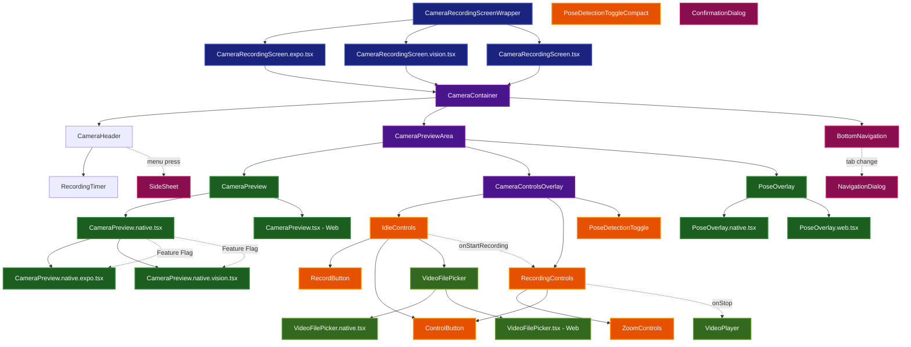

# Camera Recording System - Design Layout Diagram

## Component Architecture Overview

### 1. Screen Layer
- **CameraRecordingScreenWrapper**: Main entry point with platform detection
- **Platform-specific implementations**: Expo, VisionCamera, and base implementations

### 2. Container Layer
- **CameraContainer**: Main layout container with safe area handling
- **CameraPreviewArea**: Camera preview container
- **CameraControlsOverlay**: Overlay for camera controls

### 3. Camera System
- **CameraPreview**: Cross-platform camera component
- **Platform implementations**: Native (Expo/VisionCamera) and Web
- **PoseOverlay**: AI pose detection visualization

### 4. Control Systems
- **IdleControls**: Pre-recording controls (record, upload, camera swap)
- **RecordingControls**: During-recording controls (pause, stop, zoom)
- **PoseDetectionToggle**: AI feature toggle

### 5. Navigation & Dialogs
- **BottomNavigation**: Tab navigation (Coach/Record/Insights)
- **NavigationDialog**: Confirmation dialogs
- **SideSheet**: History and settings drawer

### 6. File Handling
- **VideoFilePicker**: Cross-platform file selection
- **Platform implementations**: Native (ActionSheet) and Web (File API)

### 7. Post-Recording
- **VideoPlayer**: Video playback and processing UI

## Key Design Patterns

1. **Platform Abstraction**: Components automatically delegate to platform-specific implementations
2. **Feature Flags**: VisionCamera vs Expo Camera selection via feature flags
3. **State Management**: Recording states flow through the component hierarchy
4. **Responsive Design**: Mobile-first with 44px touch targets
5. **Accessibility**: Comprehensive ARIA labels and screen reader support
