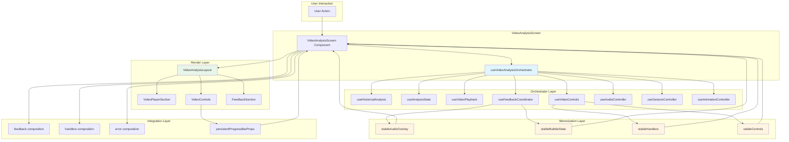
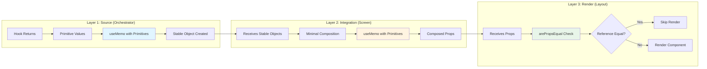
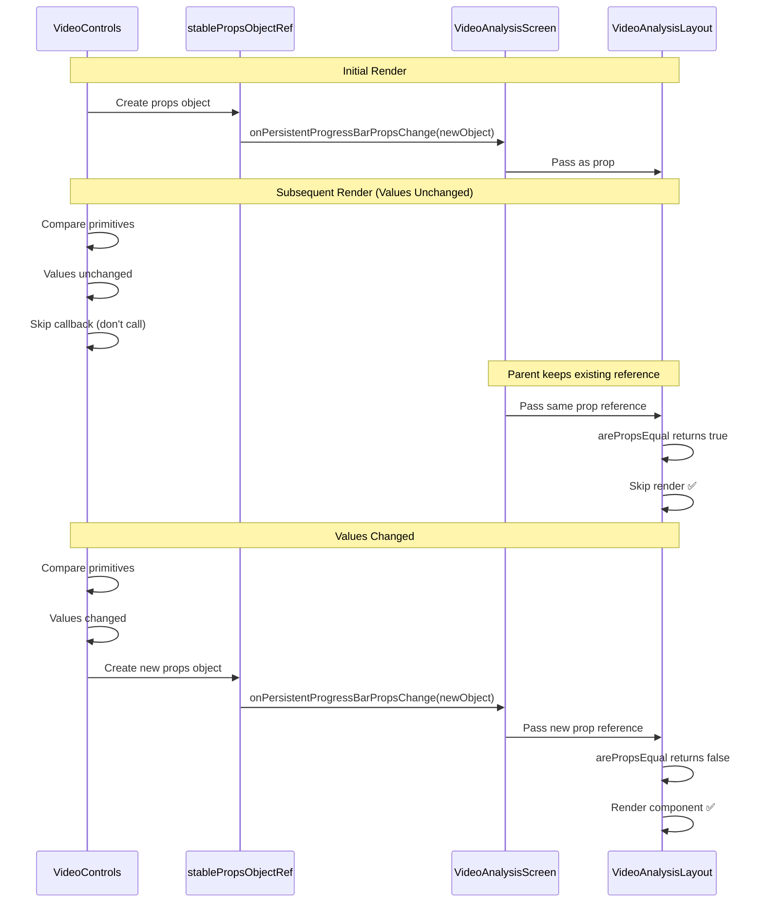
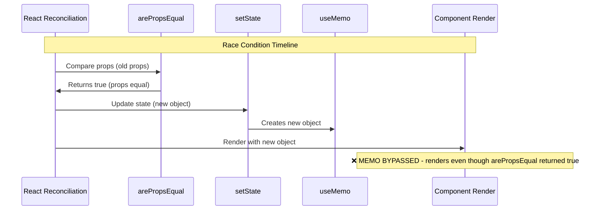
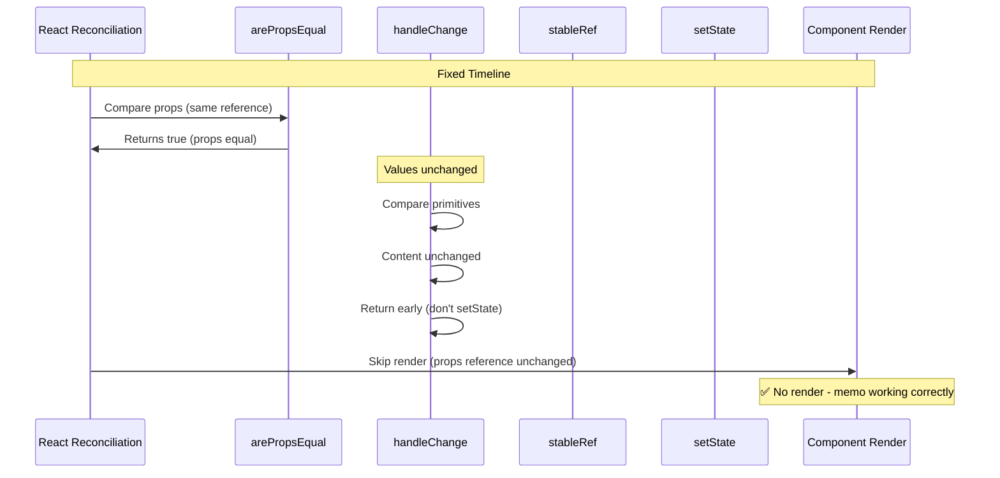
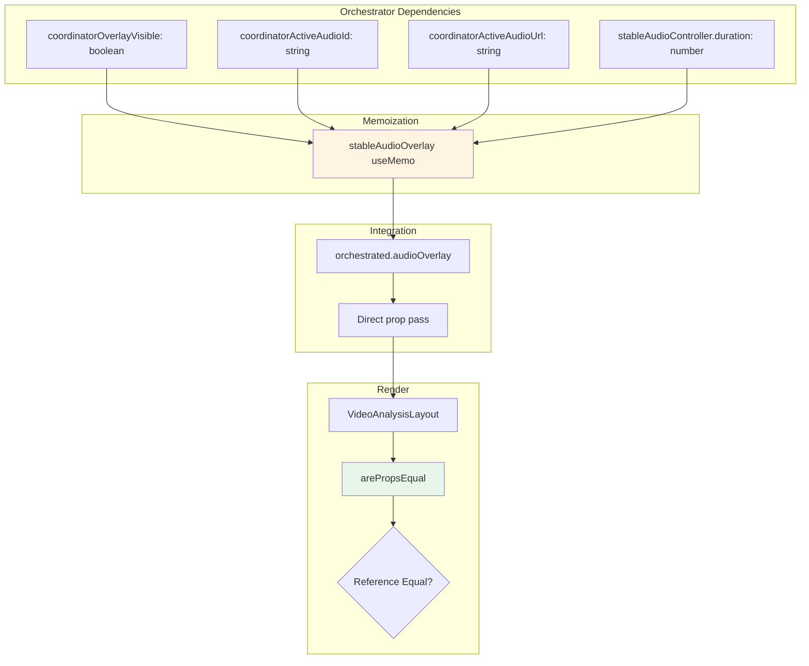
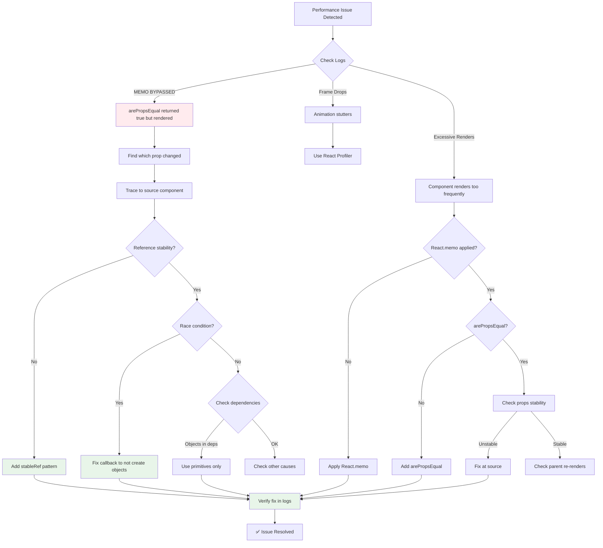
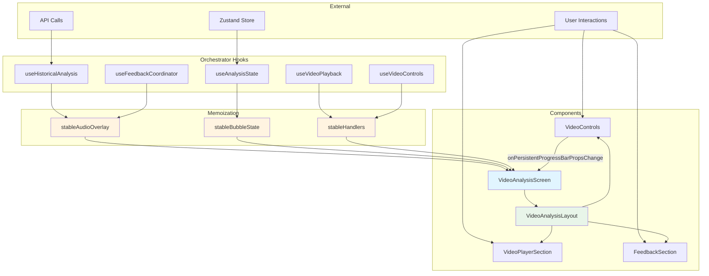

# Performance Architecture Diagrams

## Data Flow: Complete System

## Memoization Flow: Three-Layer Strategy

## Reference Stability Flow: Persistent Progress Bar

## Race Condition: Before vs After Fix

### Before Fix (Race Condition)

### After Fix (No Race Condition)

## Dependency Chain Visualization

## Issue Detection Flow

## Component Interaction Map

---

**Note**: These diagrams can be rendered in any Markdown viewer that supports Mermaid (GitHub, GitLab, VS Code with Mermaid extension, etc.)

**Related Documentation**:
- `docs/performance/react-memoization-architecture.md` - Full architecture documentation
- `docs/performance/debugging-quick-reference.md` - Quick debugging guide

