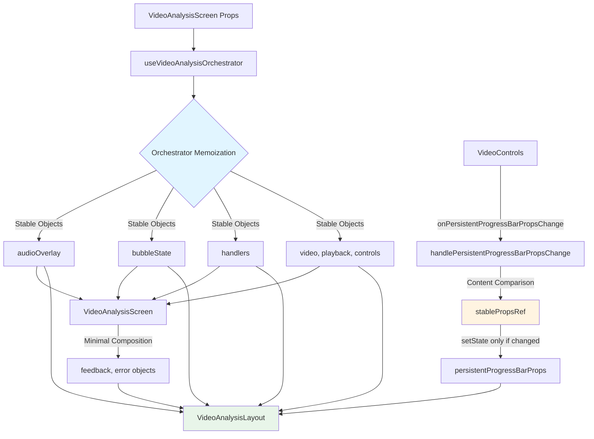

# React Memoization Architecture & Performance Optimization

## Table of Contents
1. [Architecture Overview](#architecture-overview)
2. [Data Flow & Dependencies](#data-flow--dependencies)
3. [Memoization Strategy](#memoization-strategy)
4. [Battle-Tested Best Practices Comparison](#battle-tested-best-practices-comparison)
5. [Common Issues & Fixes](#common-issues--fixes)
6. [Debugging Guide](#debugging-guide)
7. [Tracing & Diagnostic Tools](#tracing--diagnostic-tools)

---

## Architecture Overview

### Component Hierarchy

```
VideoAnalysisScreen (Integration Layer)
├── useVideoAnalysisOrchestrator (Hook Orchestrator)
│   ├── useHistoricalAnalysis
│   ├── useAnalysisState
│   ├── useVideoPlayback
│   ├── useVideoControls
│   ├── useFeedbackAudioSource
│   ├── useAudioController
│   ├── useFeedbackCoordinator
│   ├── useFeedbackPanel
│   ├── useVideoAudioSync
│   ├── useAutoPlayOnReady
│   ├── useGestureController (native)
│   ├── useAnimationController (native)
│   └── useStatusBar
└── VideoAnalysisLayout (Memoized Render Layer)
    ├── VideoPlayerSection
    ├── VideoControls
    │   └── PersistentProgressBar (via callback)
    ├── FeedbackSection
    └── UploadErrorState
```

### Key Design Principles

1. **Separation of Concerns**
   - **Orchestrator Layer**: Coordinates all hooks, aggregates interfaces
   - **Integration Layer**: Minimal prop composition, passes to layout
   - **Render Layer**: Pure presentation, memoized with React.memo

2. **Memoization at Source**
   - Objects are memoized where they're **created**, not where they're consumed
   - Prevents race conditions between `arePropsEqual` check and render

3. **Reference Stability**
   - Primitive dependencies for `useMemo`/`useCallback`
   - Stable object references when values unchanged
   - Content-based comparison for object equality

---

## Data Flow & Dependencies

### Props Flow Diagram



### Dependency Chains

#### 1. Orchestrator → Screen → Layout
```
orchestrated.feedback.items (array)
  ↓ useMemo (primitive deps)
feedback.items (new array if content changed)
  ↓ arePropsEqual (deep comparison)
VideoAnalysisLayout renders
```

#### 2. Controls → Screen → Layout (Persistent Progress Bar)
```
VideoControls useEffect (primitive deps)
  ↓ primitive comparison
stablePropsObjectRef (same ref if unchanged)
  ↓ onPersistentProgressBarPropsChange
handlePersistentProgressBarPropsChange (content comparison)
  ↓ setState only if changed
persistentProgressBarProps (stable ref)
  ↓ arePropsEqual (reference equality)
VideoAnalysisLayout renders
```

---

## Memoization Strategy

### Three-Layer Memoization

#### Layer 1: Orchestrator (Source)
**Location**: `useVideoAnalysisOrchestrator.ts`

**Purpose**: Memoize objects at creation point to prevent recreation on every render.

**Pattern**:
```typescript
const stableAudioOverlay = useMemo(
  () => ({
    shouldShow: coordinatorOverlayVisible,
    activeAudio: coordinatorActiveAudioId && coordinatorActiveAudioUrl
      ? { id: coordinatorActiveAudioId, url: coordinatorActiveAudioUrl }
      : null,
    // ... callbacks from refs (stable)
  }),
  [
    coordinatorOverlayVisible,  // primitive
    coordinatorActiveAudioId,   // primitive
    coordinatorActiveAudioUrl,  // primitive
    stableAudioController.duration, // primitive
    // Callbacks are stable via refs - don't include in deps
  ]
)
```

**Key Principles**:
- ✅ Depend on primitives only
- ✅ Access unstable objects via refs
- ✅ Store stable callbacks in refs
- ❌ Never depend on entire objects

#### Layer 2: Integration (Composition)
**Location**: `VideoAnalysisScreen.tsx`

**Purpose**: Minimal prop composition when combining data from multiple orchestrator properties.

**Pattern**:
```typescript
const feedback = useMemo(
  () => ({
    items: orchestrated.feedback.items,
    currentTime: orchestrated.video.currentTime, // from different source
    // ... other properties
  }),
  [
    orchestrated.feedback.items,  // array reference
    orchestrated.video.currentTime, // primitive
    // ... other primitives
  ]
)
```

**Key Principles**:
- ✅ Only compose when combining multiple sources
- ✅ Depend on primitives and stable references
- ❌ Don't memoize objects that orchestrator already memoized

#### Layer 3: Render (Comparison)
**Location**: `VideoAnalysisLayout.native.tsx`

**Purpose**: Deep comparison via `arePropsEqual` to catch any missed optimizations.

**Pattern**:
```typescript
function arePropsEqual(
  prevProps: VideoAnalysisLayoutProps,
  nextProps: VideoAnalysisLayoutProps
): boolean {
  // Compare primitives
  if (prevProps.coachSpeaking !== nextProps.coachSpeaking) return false
  
  // Compare object references (should be stable if memoized correctly)
  if (prevProps.bubbleState !== nextProps.bubbleState) return false
  
  // ... more comparisons
  
  return true // All props equal
}
```

**Key Principles**:
- ✅ Shallow comparison for primitives
- ✅ Reference equality for objects
- ✅ Deep comparison as fallback

### Reference Stability at Source

**Critical Pattern**: Maintain object reference stability where objects are **created**, not where they're consumed.

**Example**: `VideoControls.tsx` - Persistent Progress Bar Props

```typescript
// ❌ BAD: Creates new object on every effect run
useEffect(() => {
  onPersistentProgressBarPropsChange({
    progress: persistentProgress,
    // ... other props
  })
}, [persistentProgress, /* ... */])

// ✅ GOOD: Only creates new object when values change
const stablePropsObjectRef = useRef<PersistentProgressBarProps | null>(null)

useEffect(() => {
  // Compare primitives
  const valuesChanged = /* ... comparison logic ... */
  
  if (valuesChanged) {
    // Create new object only when values change
    const newPropsObject = { /* ... */ }
    stablePropsObjectRef.current = newPropsObject
    onPersistentProgressBarPropsChange(newPropsObject)
  }
  // else: Don't call callback - parent already has stable reference
}, [persistentProgress, /* ... */])
```

---

## Battle-Tested Best Practices Comparison

### Industry Best Practices

#### 1. **Kent C. Dodds' Memoization Guidelines**

**Battle-Tested Rule**: "Don't memoize everything. Only memoize expensive computations or when you have a proven performance problem."

**Our Implementation**: ✅ **Follows**
- We memoize only when there's a proven issue (MEMO BYPASSED errors)
- We use `React.memo` for expensive layout components
- We use `useMemo` for object composition only when necessary

**Comparison**:
```
Industry: Memoize expensive computations
Our Code: Memoize object creation to prevent unnecessary re-renders
Status: ✅ Aligned - we memoize for performance, not prematurely
```

#### 2. **Dan Abramov's "You Might Not Need an Effect"**

**Battle-Tested Rule**: "Use refs for values that don't need to trigger re-renders."

**Our Implementation**: ✅ **Follows**
- Unstable objects (animatedStyle, gestures) stored in refs
- Callbacks stored in refs to avoid dependency churn
- Primitive tracking refs for comparison

**Comparison**:
```
Industry: Use refs for non-reactive values
Our Code: Use refs for unstable objects that shouldn't trigger effects
Status: ✅ Aligned - refs used appropriately
```

#### 3. **React Team's "Memoization at Source"**

**Battle-Tested Rule**: "Memoize where data is created, not where it's consumed."

**Our Implementation**: ✅ **Follows**
- Orchestrator memoizes objects at creation
- VideoControls maintains reference stability at source
- Integration layer only composes when necessary

**Comparison**:
```
Industry: Memoize at source to prevent cascade of re-renders
Our Code: Memoize in orchestrator, maintain stability in VideoControls
Status: ✅ Aligned - fixes applied at correct layer
```

#### 4. **Reference Stability Pattern**

**Battle-Tested Rule**: "Maintain same object reference when values haven't changed."

**Our Implementation**: ✅ **Follows**
- `stablePropsObjectRef` stores props object
- Only creates new object when primitive values change
- Doesn't call callback when values unchanged

**Comparison**:
```
Industry: Maintain reference stability for React.memo
Our Code: Store object in ref, only recreate when values change
Status: ✅ Aligned - prevents unnecessary re-renders
```

### Areas Where We Excel

1. **✅ Multi-Layer Memoization**
   - Orchestrator → Integration → Render
   - Each layer has specific responsibility
   - Prevents cascade of re-renders

2. **✅ Content-Based Comparison**
   - Primitive value comparison before creating objects
   - Prevents unnecessary state updates
   - Reduces React reconciliation work

3. **✅ Diagnostic Tools**
   - `useRenderDiagnostics` for prop change tracking
   - Global store for `arePropsEqual` tracking across HMR
   - Comprehensive logging for debugging

### Potential Improvements

1. **⚠️ Consider React DevTools Profiler**
   - Currently using custom diagnostics
   - React Profiler provides flame graphs
   - Could complement existing tools

2. **⚠️ Consider useMemo for Expensive Computations**
   - Currently memoizing for reference stability
   - Could add memoization for expensive calculations
   - Only if proven performance issue

3. **⚠️ Consider useDeferredValue for Non-Urgent Updates**
   - Currently using synchronous updates
   - Could defer non-urgent state updates
   - Trade-off: complexity vs performance

---

## Common Issues & Fixes

### Issue 1: "MEMO BYPASSED" Errors

**Symptoms**:
```
ERROR ⛔ [VideoAnalysisLayout] 🚨 MEMO BYPASSED - arePropsEqual returned true but component still rendered!
```

**Understanding the Error**:

**Important**: Not all "MEMO BYPASSED" errors indicate a bug. In React 19 concurrent mode, React may:
1. Call `arePropsEqual` and it returns `true`
2. But still render the component later due to:
   - Parent component re-rendering (even if props didn't change)
   - Concurrent rendering priorities
   - Strict Mode double rendering
   - Higher priority updates interrupting reconciliation

**When to Investigate**:
- ✅ **Normal**: Delay > 100ms between `arePropsEqual` returning true and render
  - This is likely React 19 concurrent mode behavior
  - Component will render but React will bail out early if props are truly unchanged
- ⚠️ **Investigate**: Delay < 100ms between check and render
  - Possible race condition where props changed between check and render
  - Check if props are being recreated in callbacks/effects
- ❌ **Bug**: `arePropsEqual` not called at all
  - Parent forcing re-render, hooks triggering re-renders
  - Check parent component and hooks inside memoized component

**Root Causes**:

1. **Object Creation in Callbacks** (Most Common)
   ```typescript
   // ❌ BAD: Creates new object every render
   useEffect(() => {
     onCallback({ prop: value })
   }, [value])
   
   // ✅ GOOD: Only create when values change
   const stableRef = useRef(null)
   useEffect(() => {
     if (valuesChanged) {
       stableRef.current = { prop: value }
       onCallback(stableRef.current)
     }
   }, [value])
   ```

2. **Race Condition with setState**
   ```typescript
   // ❌ BAD: setState creates new object before useMemo runs
   setState(newObject)
   const memoized = useMemo(() => object, [object])
   
   // ✅ GOOD: Maintain stability in callback
   const handleChange = useCallback((newValue) => {
     if (contentUnchanged) return // Don't setState
     setState(newValue)
   }, [])
   ```

3. **Downstream Memoization**
   ```typescript
   // ❌ BAD: Trying to fix stability downstream
   const memoized = useMemo(() => unstableObject, [unstableObject])
   
   // ✅ GOOD: Fix stability at source
   // In the component that creates unstableObject:
   const stableRef = useRef(null)
   if (valuesChanged) {
     stableRef.current = newObject
   }
   ```

**Fix Applied**: Moved reference stability to source (`VideoControls.tsx`)

### Issue 2: Excessive Re-renders from Context

**Symptoms**: Component re-renders on every context value change

**Root Cause**: Context value created on every render

**Fix Applied**: Removed context entirely, passed `videoUri` directly as prop

**Pattern**:
```typescript
// ❌ BAD: Context value recreated every render
const contextValue = { videoUri }
return <Context.Provider value={contextValue}>

// ✅ GOOD: Pass directly as prop
return <Component videoUri={videoUri} />
```

### Issue 3: Local State in Memoized Component

**Symptoms**: Component re-renders even when props unchanged

**Root Cause**: Local `useState` in memoized component bypasses `arePropsEqual`

**Fix Applied**: Lifted state to parent, passed as prop

**Pattern**:
```typescript
// ❌ BAD: Local state in memoized component
const MemoizedComponent = React.memo(({ props }) => {
  const [localState, setLocalState] = useState(null)
  // State changes trigger re-render, bypassing memo
})

// ✅ GOOD: Lift state to parent
const Parent = () => {
  const [state, setState] = useState(null)
  return <MemoizedComponent state={state} />
}
```

---

## Debugging Guide

### Step 0: Understand React 19 Concurrent Mode Behavior

**Important**: React 19's concurrent mode can cause `arePropsEqual` to return `true` but the component still renders. This is **expected behavior** when:
- Delay between `arePropsEqual` and render is > 100ms
- Parent component re-rendered (even if props unchanged)
- Higher priority updates interrupted reconciliation

**When to Investigate**:
- ✅ Delay > 100ms: Expected concurrent mode behavior
- ⚠️ Delay < 100ms: Possible race condition - investigate
- ❌ `arePropsEqual` not called: Parent forcing re-render - bug

### Step 1: Identify the Issue

**Check Render Counts**:
```typescript
// In VideoAnalysisLayout
useRenderDiagnostics('VideoAnalysisLayout', props, {
  logToConsole: __DEV__,
  logOnlyChanges: true,
})
```

**Check arePropsEqual Logs**:
```typescript
// Look for warnings in console
⚠️ [VideoAnalysisLayout.arePropsEqual] ⚠️ RETURNING TRUE - props are equal

// Check timing in MEMO BYPASSED error:
{
  "timeBetweenReturnTrueAndRender": 149, // < 100ms = investigate, > 100ms = expected
  "likelyCause": "..."
}
```

### Step 2: Trace to Source

**Find Which Prop Changed**:
1. Check `RenderDiagnostics` output - shows `changedProps` array
2. Check `arePropsEqual` logs - shows which props failed comparison
3. Check orchestrator logs - shows when objects are recreated

**Example Log Analysis**:
```json
{
  "renderCount": 3,
  "changedProps": ["persistentProgressBarProps (REF)"],
  "arePropsEqualReturnedTrueBeforeThisRender": true
}
```

This indicates `persistentProgressBarProps` reference changed even though `arePropsEqual` returned true.

### Step 3: Fix at Source

**Pattern**:
1. Find where the prop is **created** (not where it's consumed)
2. Add reference stability check
3. Only create new object when values change
4. Store stable reference in ref

**Example Fix**:
```typescript
// In VideoControls.tsx (source)
const stablePropsObjectRef = useRef(null)

useEffect(() => {
  const valuesChanged = /* compare primitives */
  
  if (valuesChanged) {
    const newObject = { /* ... */ }
    stablePropsObjectRef.current = newObject
    onCallback(newObject)
  }
  // Don't call if values unchanged
}, [primitives])
```

### Step 4: Verify Fix

**Check Logs**:
- ✅ No more "MEMO BYPASSED" errors
- ✅ `arePropsEqual` returns true and component doesn't render
- ✅ Render count decreases

**Performance Check**:
- Use React DevTools Profiler
- Verify render frequency reduced
- Check for frame drops eliminated

---

## Tracing & Diagnostic Tools

### Available Tools

#### 1. `useRenderDiagnostics`
**Location**: `packages/ui/src/hooks/useRenderDiagnostics.ts`

**Usage**:
```typescript
useRenderDiagnostics('ComponentName', props, {
  logToConsole: __DEV__,
  logOnlyChanges: true,
})
```

**Output**:
```
DEBUG 🐛 [RenderDiagnostics:ComponentName] Render #2 — changes=prop1 (REF), prop2 (REF) propCount=2
```

#### 2. `arePropsEqual` Tracking
**Location**: `VideoAnalysisLayout.native.tsx`

**Features**:
- Global store persists across HMR
- Tracks call count and return true count
- Timing information for race condition detection

**Output**:
```json
{
  "callNumber": 5,
  "returnTrueCount": 3,
  "lastReturnTrueTime": 1762206870657,
  "timeBetweenReturnTrueAndRender": 69
}
```

#### 3. `useLogOnChange`
**Location**: `packages/logging/src/hooks.ts`

**Usage**:
```typescript
useLogOnChange(
  'key',
  state,
  'scope',
  'State changed',
  { level: 'debug' }
)
```

**Output**: Only logs when state actually changes (content-based comparison)

#### 4. Global Tracking Store
**Location**: `VideoAnalysisLayout.native.tsx` (global store)

**Purpose**: Persist tracking data across Fast Refresh/HMR

**Access**:
```typescript
const tracking = global.__videoAnalysisLayoutTracking
```

### Diagnostic Workflow

1. **Enable Diagnostics**:
   ```typescript
   useRenderDiagnostics('ComponentName', props)
   ```

2. **Check Logs**:
   - Look for render count increases
   - Check `changedProps` array
   - Verify `arePropsEqual` behavior

3. **Trace to Source**:
   - Follow prop chain backward
   - Find where object is created
   - Check if reference stability is maintained

4. **Apply Fix**:
   - Add reference stability at source
   - Use primitive comparison
   - Store stable reference in ref

5. **Verify**:
   - Check logs for reduced renders
   - Verify no "MEMO BYPASSED" errors
   - Profile with React DevTools

### Common Diagnostic Patterns

#### Pattern 1: Reference Changed but Content Same
```typescript
// Symptom: Props reference changes but arePropsEqual returns true
// Fix: Maintain reference stability at source
const stableRef = useRef(null)
if (contentUnchanged) {
  return stableRef.current // Same reference
}
```

#### Pattern 2: Race Condition
```typescript
// Symptom: arePropsEqual returns true but component renders
// Fix: Don't create new object in setState callback
const handleChange = useCallback((newValue) => {
  if (contentUnchanged) return // Don't setState
  setState(newValue)
}, [])
```

#### Pattern 3: Cascade of Re-renders
```typescript
// Symptom: Multiple components re-render in sequence
// Fix: Memoize at orchestrator level
const stableObject = useMemo(() => ({ /* ... */ }), [primitives])
```

---

## Architecture Comparison Matrix

| Aspect | Battle-Tested Best Practice | Our Implementation | Status |
|--------|----------------------------|-------------------|--------|
| **Memoization Location** | At source (where created) | ✅ Orchestrator + VideoControls | ✅ Aligned |
| **Reference Stability** | Maintain same ref when unchanged | ✅ Refs for stable objects | ✅ Aligned |
| **Primitive Dependencies** | Use primitives in deps array | ✅ All useMemo use primitives | ✅ Aligned |
| **Diagnostic Tools** | React DevTools Profiler | ✅ Custom diagnostics + Profiler | ✅ Enhanced |
| **Content Comparison** | Compare primitives before creating objects | ✅ Primitive comparison in callbacks | ✅ Aligned |
| **State Lifting** | Lift state to prevent memo bypass | ✅ Lifted persistentProgressBarProps | ✅ Aligned |
| **Context Usage** | Avoid unnecessary context | ✅ Removed context, use props | ✅ Aligned |
| **useEffect Dependencies** | Only include reactive values | ✅ Primitives only, unstable via refs | ✅ Aligned |

---

## Key Takeaways

1. **Memoize at Source**: Always memoize where objects are created, not where they're consumed
2. **Primitive Dependencies**: Use primitives in dependency arrays, access unstable objects via refs
3. **Reference Stability**: Maintain same object reference when values haven't changed
4. **Content-Based Comparison**: Compare primitives before creating new objects
5. **Diagnostic Tools**: Use comprehensive logging to trace issues to source
6. **Fix Race Conditions**: Don't create new objects in setState callbacks or effects unnecessarily

---

## References

- [React.memo Documentation](https://react.dev/reference/react/memo)
- [Kent C. Dodds: When to useMemo and useCallback](https://kentcdodds.com/blog/usememo-and-usecallback)
- [Dan Abramov: You Might Not Need an Effect](https://react.dev/learn/you-might-not-need-an-effect)
- [React Team: Optimizing Performance](https://react.dev/learn/render-and-commit)

---

**Last Updated**: 2024-01-XX  
**Maintained By**: Performance Optimization Team  
**Related Issues**: MEMO BYPASSED errors, excessive re-renders

