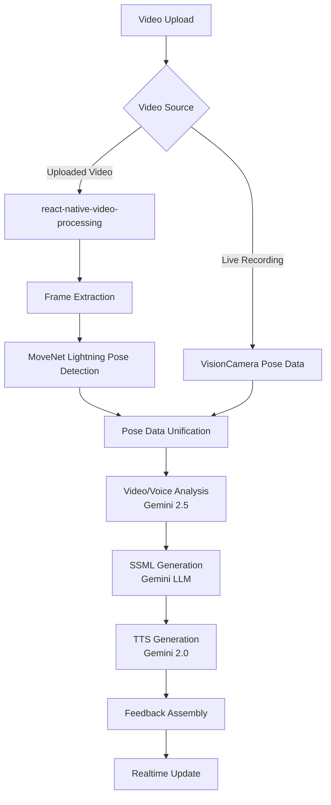

# Technical Requirements Document: Solo:Level MVP - AI Feedback Coach App

## Title Page
* **Product Name**: Solo:Level — Upskill Differently
* **Document Title**: "Technical Design Document for Solo:Level MVP"
* **Version**: 0.1 (MVP)
* **Authors**: Yevgen Schweden (PM), Engineering Team
* **Date**: 2025-08-26
* **Approvals**: TBD (PM, Eng Lead, AI Lead)

---

## Executive Summary
* **Purpose**: Specify the end-to-end technical design for the Solo:Level MVP that delivers instant, multi‑modal AI feedback on short user videos across iOS/Android/Web.
* **Scope**: Covers client apps (Expo + Next.js), backend (Supabase, Edge Functions), AI analysis (pose/video/voice/LLM), storage, security, monitoring, and release plan. 
* **Out of Scope**: monetization, marketplace, advanced analytics beyond trends.
* **Audience**: Engineers, QA, PM, Design, DevOps.

---

## Introduction
* **Background**: Users want immediate, actionable feedback on performance activities (speaking, movement, delivery). Manual coaching is slow and expensive.
* **Problem Statement**: Deliver consistent, actionable feedback within < 10s for user-submitted videos, in engaging formats (text, audio, metrics) on mobile-first UX.
* **Objectives**:
  - TTFB feedback < 10s for 60s videos
  - Upload and record flows that are robust on mobile networks
  - Clear, memorable feedback: summary, audio commentary, quantitative metrics
  - Track progress over time per user

---

## Requirements
* **Functional Requirements**:
  1. Video capture or upload (MP4/MOV), max 60s; show duration and size
  2. Background upload to Supabase Storage with progress and retry
  3. AI analysis pipeline (video + LLM feedback + TTS audio) via Edge Function
  4. Feedback surface: text summary, SSML/audio commentary, metrics/radar
  5. History list and detail views with share options
  6. Auth (email/social) and basic profile
* **Non-Functional Requirements**:
  - Performance: analysis < 10s median; app launch < 3s
  - Reliability: upload retries, resumable uploads, idempotent jobs
  - Security: RLS on all tables, signed URLs short TTL, PII minimization
  - Accessibility: WCAG 2.2 AA for web, RN accessibility roles/labels for native
  - Observability: structured logs, error correlation IDs, basic metrics
* **User Stories/Use Cases**:
  - See user stories in the folder docs/spec/user_strories/

---

## System Architecture
* **High-Level Architecture Diagram**:

```mermaid
flowchart TD
  A[Expo App (iOS/Android)] -- TanStack Query/Auth --> S[(Supabase)]
  W[Next.js Web] -- TanStack Query/Auth --> S
  A -- Upload --> ST[(Supabase Storage: raw/processed)]
  W -- Upload --> ST
  A & W -- Invoke --> EF[Edge Functions: ai-analyze-video, tts]
  EF -- Read/Write --> ST
  EF -- Read/Write --> DB[(PostgreSQL)]
  EF -- Call --> AI[AI Providers (Pose/ASR/LLM/TTS)]
  DB <-- Realtime --> A
  DB <-- Realtime --> W
```

* **Technology Stack**:
  - See `core/monorepo-foundation.mdc` for general tech stack (Expo + Next.js, Tamagui, Zustand, TanStack Query, Expo Router, TypeScript, Yarn 4 + Turbo)
  - **Product-specific AI Pipeline**: Real-time pose detection + Video analysis + LLM feedback + TTS generation

## **Native Platform Stack (iOS/Android):**

### **1. Camera & Pose Detection**
* **Primary:** `react-native-vision-camera` v4+ 
* **Pose Engine:** `react-native-fast-tflite` v1.6.1 + **MoveNet Lightning** (replacing ML Kit)
* **Model:** `movenet_lightning_int8.tflite` for optimal performance
* **Overlay:** `react-native-skia` for pose landmarks rendering
* **Recording:** VisionCamera's built-in recording capabilities
* **Threading:** `react-native-worklets-core` for native thread processing

### **2. Video Processing & Analysis**
* **Upload Processing:** `react-native-video-processing` v2+ for frame extraction and pose detection
* **Frame Extraction:** Real-time frame-by-frame processing with configurable intervals (30fps default)
* **Pose Detection Pipeline:** Same MoveNet Lightning model for consistency with live recording
* **Data Format:** Unified `PoseDetectionResult[]` structure matching VisionCamera recording format
* **Performance:** Background processing with progress callbacks and memory optimization
* **Threading:** Worklet-based processing to avoid blocking UI during analysis

### **3. Video Playback & Overlay**
* **Primary:** `react-native-video` v6+
* **Overlay:** `react-native-skia` for pose landmarks rendering
* **Performance:** Native-threaded overlay synchronization

## **Web Platform Stack:**

### **1. Camera & Pose Detection (Leveraging Native Insights)**

#### **Primary Engine: TensorFlow.js with MoveNet (Unified with Native)**
* **Model:** `@tensorflow-models/pose-detection` with **MoveNet Lightning** (same as native!)
* **Backend:** `@tensorflow/tfjs-backend-webgpu` with WebGL fallback
* **Processing:** Web Workers with **OffscreenCanvas** for native-like performance
* **Camera:** Enhanced getUserMedia() API with **ImageCapture** for better frame control

#### **Overlay Rendering (Native-Inspired)**
* **Primary:** **OffscreenCanvas + Web Workers** (mimicking native threading)
* **Rendering:** RequestAnimationFrame with **frame-perfect synchronization**
* **Optimization:** Canvas pooling and GPU-accelerated transforms

### **2. Video Recording & Processing**
* **Primary:** MediaRecorder API with **configurable bitrates**
* **Processing:** **Dedicated Web Workers** for pose detection during recording
* **Streaming:** Real-time pose data streaming to match native performance

### **3. Video Playback & Overlay**
* **Primary:** HTML5 `<video>` with **frame control**
* **Overlay:** **WebGL-accelerated Canvas** with GPU transforms
* **Sync:** **High-resolution timer** + video currentTime for frame-perfect alignment

## **Shared Components:**
* **State Management:** Zustand stores for pose data, performance metrics, and recording state
* **Data Compression:** Optimized pose data storage and transmission
* **File Management:** expo-file-system for videos and pose data export
* **Local Storage:** AsyncStorage for user preferences, SQLite for pose data
* **Video Analysis:** Gemini flash 2.5 first then pro 2.5
* **Voice Analysis:** Optional ASR/Voice metrics processing
* **MMM Integration:** Gemini 2.5 text feedback generation together with video analysis
* **TTS Pipeline:** Audio commentary via gemini TTS 2.0 → Convert to AAC/MP3 format for optimal mobile/web compatibility
* **Data Flow**:
  1. Client records or selects a video
  2. Client uploads to Storage bucket `raw` via signed URL
  3. Client calls `ai-analyze-video` with storage path; receives job id
  4. Edge function extracts frames, runs pose + voice, calls LLM, generates SSML/TTS, converts audio to AAC/MP3, writes to DB and `processed` storage
  5. Client subscribes to analysis row via Realtime; UI updates when complete
* **Third-Party Integrations**:
  - **Native**: TensorFlow Lite + MoveNet Lightning model
  - **Web**: TensorFlow.js + MoveNet Lightning model (unified cross-platform)
  - **TTS Provider**: gemini TTS 2.0 for audio commentary (output converted to AAC/MP3)
  - **MMM Provider**: gemini 2.5 for feedback text generation
  - **Performance**: WebGPU/WebGL acceleration for web, native GPU acceleration for mobile

---

## Detailed Design
* **Component Design**:
  - Mobile/Web UI (Tamagui):
    - Capture/Upload Screen: camera permissions, record controls, upload progress
    - Analysis Progress: job state, ETA bar, cancel
    - Feedback Screen: text summary, audio player, radar chart of metrics
    - History Screen: list with date/score, detail navigation
  - Stores (Zustand): `mediaStore` (recording/upload), `analysisStore` (current job/progress), `profileStore`
  - Server State (TanStack Query): `useAnalyzeVideo`, `useAnalysisHistory`, `useAnalysis(analysisId)`

* **Database Schema (Supabase, public schema)**:
  - `profiles` (user_id uuid PK/FK auth.users, username text unique, created_at)
  - `analyses` (
      id bigint identity PK,
      user_id uuid FK -> auth.users,
      video_url text, status text check in ('queued','processing','completed','failed'),
      summary_text text, ssml text, audio_url text,
      created_at timestamptz default now()
    ) RLS enabled
  - `analysis_metrics` (
      id bigint identity PK,
      analysis_id bigint FK -> analyses(id) on delete cascade,
      metric_key text, metric_value numeric, unit text
    ) RLS enabled
  - Storage buckets: `raw` (uploads), `processed` (thumbnails, audio in AAC/MP3 format)
  - Policies: select/insert/update restricted to owner `(select auth.uid()) = user_id`

* **API Specifications (Edge Functions)**:
  - `POST /functions/v1/ai-analyze-video`
    - Request: `{ videoPath: string, userId?: string }`
    - Response: `{ analysisId: string }`
  - `GET /functions/v1/analysis-status?id=...`
    - Response: `{ id, status, progress?: number }`
  - `POST /functions/v1/tts`
    - Request: `{ ssml: string, voice?: string }`
    - Response: `{ audioUrl: string }`
  - Notes: Prefer Supabase Realtime over polling for completion.

* **AI Pipeline Flow**:



* **Algorithms and Logic (Overview)**:
  1. **Video Source Detection**: Determine if video has existing pose data (live recording) or needs processing (uploaded video)
  2. **Frame Extraction Pipeline**: 
     - Live Recording: Use existing VisionCamera pose data from `PoseDetectionResult[]` format
     - Uploaded Video: Use `react-native-video-processing` to extract frames at configurable intervals (default 30fps)
  3. **Pose Detection Unification**: 
     - Apply MoveNet Lightning model to extracted frames for uploaded videos
     - Maintain consistent `PoseDetectionResult[]` format across both sources
     - Confidence filtering and temporal smoothing for uploaded video pose data
  4. **Video/Voice Analysis**: Gemini 2.5 processes video frames, pose data, and audio for comprehensive feedback
  5. **Metrics Aggregation**: Normalized 0–100 scales from pose keypoints and movement analysis; compose radar values
  6. **LLM Prompt**: Builds structured feedback with key takeaways and next steps using unified pose data
  7. **SSML Generation**: Gemini LLM creates structured speech markup from feedback
  8. **TTS Generation**: Gemini 2.0 converts SSML to audio; convert to AAC/MP3 format; store audio; save all artifacts/URLs to DB

* **Audio Playback Strategy**:
  - **Format Optimization**: Convert TTS output from WAV to AAC/MP3 for 75%+ file size reduction
  - **Cross-Platform Compatibility**: AAC primary (iOS/Android), MP3 fallback (universal), OGG for web
  - **Client Playback**: Use `react-native-video` for unified video/audio playback across platforms
  - **Audio-Only Fallback**: `react-native-sound` if needed for dedicated audio-only files
  - **Web Fallback**: HTML5 `<audio>` element with multiple format sources
  - **Performance**: Compressed formats reduce load times and memory consumption on mobile devices
  - **User Experience**: Require user interaction to initiate audio playback (autoplay restrictions)

* **Error Handling**:
  - Use discriminated union results in client hooks
  - Edge: validate inputs with Zod, timeouts/retries for providers, structured error codes
  - User-safe messages; log correlation id; avoid leaking provider details

---

## Security Considerations
* **General Security**: See `core/monorepo-foundation.mdc` and `quality/security-best-practices.mdc`
* **Product-specific Threats**:
  - Unauthorized access to videos/artifacts → mitigate with signed URLs short TTL and RLS
  - Prompt/response injection in LLM calls → sanitize inputs, allowlist outputs, cap tokens
  - Abuse (large uploads, job storms) → size limits, rate limiting, quotas per user
* **Product-specific Security**:
  - Owner-only access to analyses via RLS policies
  - Do not store raw PII in logs

---

## Performance and Scalability
* **Load Handling**:
  - Async analysis jobs; realtime updates; queue long tasks with pg_cron/webhooks if needed
* **Caching Strategies**:
  - Cache LLM/TTS for identical SSML; CDN for `processed` artifacts (AAC/MP3 audio files)
* **Scaling**:
  - Horizontal scale Edge Functions; Storage/CDN scales automatically; DB indexes on `analyses.user_id`, `created_at`

---

## Testing Strategy
* **General Testing**: See `quality/testing-unified.mdc` for unit/integration testing patterns
* **Product-specific Testing**:
  - Performance: 60s sample videos across network profiles; measure end-to-end < 10s median
  - Security: RLS policy checks, signed URL TTL, auth path coverage
  - UAT: Verify wireflow screens and interactions on iOS/Android and web

---

## Deployment Plan
* **Environment Setup**:
  - See `core/development-operations.mdc` for local development setup
  - Staging/Prod: Supabase projects per environment; secrets in CI
* **Deployment Pipeline**:
  - See `core/development-operations.mdc` for build commands and CI patterns
  - Edge Functions CI: bundle and deploy via Supabase CLI
* **Rollout Strategy**:
  - Phased: internal test → beta → GA; feature flags for TTS
* **Rollback Plan**:
  - Previous function versions retained; DB migrations reversible; toggle flags to disable AI features

---

## Monitoring and Maintenance
* **Logging**: Structured logs in Edge; request ids; client breadcrumbs for uploads
* **Monitoring Tools**: Supabase logs and metrics; optional Sentry for client/app
* **Alerting**: Error rate thresholds on Edge; slow job alerts > 15s
* **Maintenance Plan**: Weekly dependency updates; provider cost audits

---

## Risks and Mitigations
* **AI accuracy variance** → human-readable confidence + clear next steps
* **Mobile upload instability** → chunked/resumable uploads, backoff retries
* **Provider rate limits/costs** → queueing, caching, cost caps by user
* **Data privacy** → short-lived URLs, least-privilege buckets, PII scrubbing

---

## Dependencies
* **Internal**: `apps/expo`, `apps/next`, `packages/ui`, `packages/app`, `packages/api`
* **External**: 
  - **Core**: Expo, Tamagui, Supabase, TanStack Query, Zustand
  - **Native Pose**: react-native-fast-tflite, react-native-vision-camera, react-native-skia, react-native-worklets-core, react-native-video
  - **Video Processing**: react-native-video-processing (frame extraction and pose detection for uploaded videos)
  - **Audio Playback**: react-native-video (primary), react-native-sound (fallback for audio-only)
  - **Web Pose**: @tensorflow/tfjs, @tensorflow-models/pose-detection, @tensorflow/tfjs-backend-webgpu
  - **AI Services**: TTS provider (Gemini 2.0), LLM provider (Gemini 2.5)
  - **Models**: MoveNet Lightning (movenet_lightning_int8.tflite)

---

## Glossary
* **LLM**: Large Language Model for generating text feedback
* **SSML**: Speech Synthesis Markup Language
* **RLS**: Row Level Security

---

## Appendix
* **References**:
  - Product PRD: ./SoloLevel-PRD.md
  - Wireflow: ./wireflow.png
* **Diagrams**: See Mermaid architecture above
* **Changelog**:
  - 0.1 (2025-08-26): Initial MVP technical design

