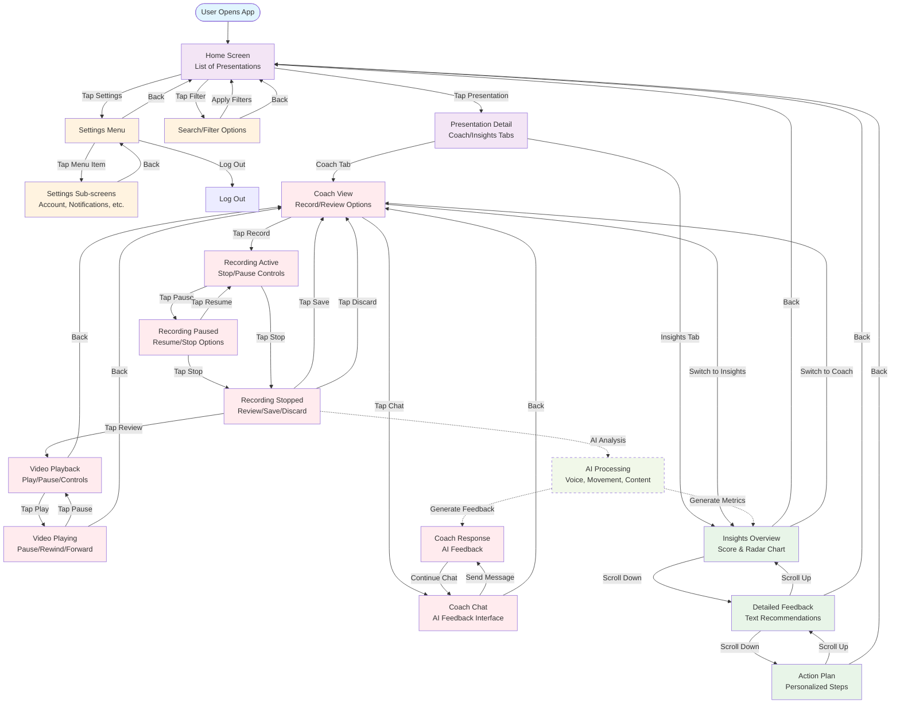

# Solo:Level User Flow Diagram

This document contains the comprehensive user flow diagram for the Solo:Level AI Feedback Coach app, based on the wireframe analysis and PRD requirements.

## User Flow Overview

The app follows a mobile-first design with three main user journeys:
1. **Presentation Playback & Recording** - Core video interaction flow
2. **AI Coach Interaction** - Chat-based feedback system  
3. **Insights & Analytics** - Performance analysis and progress tracking
4. **Home & Settings** - Navigation and app management

## Mermaid Diagram

## Key User Journeys

### 1. Presentation Recording & Review
- **Entry**: Home → Select Presentation → Coach Tab
- **Flow**: Record → Pause/Resume → Stop → Review/Save/Discard
- **AI Integration**: Automatic analysis after recording stops

### 2. AI Coach Interaction  
- **Entry**: Coach Tab → Chat Interface
- **Flow**: Send Message → Receive AI Feedback → Continue Conversation
- **Features**: Real-time chat with AI coach for personalized guidance

### 3. Performance Insights
- **Entry**: Insights Tab → Overview → Detailed → Action Plan
- **Flow**: Score Review → Detailed Feedback → Personalized Recommendations
- **Visualization**: Radar charts, bar graphs, progress metrics

### 4. App Management
- **Entry**: Home → Settings → Sub-menus
- **Flow**: Account, Notifications, Privacy, Help, About
- **Features**: User preferences, data management, support

## Technical Integration Points

### AI Processing Pipeline
1. **Video Analysis**: Voice, movement, content analysis
2. **Feedback Generation**: Text, audio, metrics
3. **Response Time**: < 10 seconds (per PRD requirements)

### Cross-Platform Considerations
- **Mobile-First**: Touch interactions, gesture navigation
- **Responsive**: Adapts to different screen sizes
- **Offline**: Basic features available without connection

## Success Metrics Alignment

This user flow supports the PRD success metrics:
- **User Engagement**: Multiple interaction points per session
- **Retention**: Progress tracking and history features
- **Viral Potential**: Share results and challenge friends (P1 features)
- **Performance**: < 10 second AI processing time

## Future Enhancements (P1/P2)

The diagram structure supports future additions:
- **Social Features**: Share results, community feedback
- **Advanced Analytics**: Trend analysis, comparative metrics  
- **Premium Features**: Custom AI models, expert integration
