# User Interaction Flow Diagram

## Overview
This document outlines the complete user interaction flow for the SoloLevel mobile application based on the actual wireframe screens. The flow covers camera recording, AI analysis, feedback review, video history management, and AI coaching features.

## Flow Diagram

```mermaid
graph TD
    %% Legend:
    %% 🚀 Entry Point: App Launch
    %% 🟣 Main Screen: Camera View with all navigation options
    %% 🟢 Side Sheet: Settings flow (C-series)
    %% 🔴 Recording: Recording + Upload Video flows (F & G-series)
    %% 🟡 Coach: Coach flow (E-series)
    %% 🔵 Insights: Insights flow (H-series)
    %% 🟣 Settings: Settings sub-screens

    %% Entry Points
    A[App Launch] --> B[Main Screen - Camera View]

    %% Main Screen Actions
    B --> C[Side Sheet]
    B --> E[Coach Tab]
    B --> F[Native Media Picker]
    B --> G[Start Recording]
    B --> H[Insights Tab]

    %% Camera Controls - Left and Right positioning
    B --> F4[Upload Video]
    B --> G0E[Camera Swap Control]

    %% Grouping Boxes
    subgraph SideSheetMenu ["🟢 Side Sheet Menu"]
        C

        subgraph Videos ["🟢 Videos"]
            C1
            C4
            C5
            C6
            C7
            C8
        end

        subgraph Settings ["🟣 Settings"]
            C3
            C9
            C10
            C11
            C12
            C13
            C14
            C15
        end
    end

    subgraph RecordingFlow ["🔴 Recording/Feedback Flow"]
        subgraph Upload ["🔵 Upload"]
            F
            F1
            F2
            F3
        end

        subgraph CameraControls ["📷 Camera Controls"]
            G0E
            F
            F1
            F2
            F3
            F4
            G
            G1
            G1A
            G1B
            G2
            G3
            G4
        end

        subgraph Analysis ["🟠 Analysis"]
            G5
            G6
        end

        subgraph FeedbackReview ["🔵 Feedback Review"]
            G7
            G8
            G9
            G10
            G11
            G12
        end
    end

    subgraph Coach ["🟡 Coach"]
        E
        E1
        E2
        E3
        E4
        E5
    end

    subgraph Insights ["🔵 Insights"]
        H
        H1
        H2
        H3
        H4
        H5
    end

    subgraph Notifications ["🔔 Notifications"]
        G0
        G0A
        G0B
        G0C
        G0D
    end

    %% Side Sheet Flow
    C --> C1[Videos List Screen]
    C --> C3[Settings Screen]
    C1 --> C
    C3 --> B

    %% Videos List Screen Actions
    C1 --> C4[Filter Screen]
    C1 --> C5[Select Video from List]
    C4 --> C1

    %% Video Detail Flow
    C5 --> C6[Video Detail View]
    C6 --> C7[Playback with Feedback]
    C7 --> C8[View AI Insights]
    C8 --> C6
    C6 --> C1

    %% Settings Screen Actions
    C3 --> C9[Account Settings]
    C3 --> C10[Personalisation]
    C3 --> C11[Give Feedback]
    C3 --> C12[Data Controls]
    C3 --> C13[Security]
    C3 --> C14[About]
    C3 --> C15[Log Out]
    C9 --> C3
    C10 --> C3
    C11 --> C3
    C12 --> C3
    C13 --> C3
    C14 --> C3


    %% Notifications Flow
    B --> G0[Notifications Menu]
    G0 --> G0A[View Notifications]
    G0 --> G0B[Mark as Read]
    G0 --> G0C[Clear All]
    G0 --> G0D[Notification Settings]
    G0A --> G0
    G0B --> G0
    G0C --> G0
    G0D --> G0
    G0 --> B

    %% Camera Controls Flow
    F4 --> F[Native Media Picker]
    G0E --> B

    %% Recording Flow - Active State
    G --> G1[Recording Active State]
    G1 --> G1A[Zoom In]
    G1 --> G1B[Zoom Out]
    G1A --> G1
    G1B --> G1
    G1 --> G2[Pause Recording]
    G1 --> G3[Stop Recording]
    G2 --> G4[Resume Recording]
    G2 --> G3
    G4 --> G1
    G3 --> G5[Analysis Processing]

    %% Upload Video
    F --> F1[Select Video]
    F --> F2[Select File]
    F --> F3[Cancel]
    F1 --> G5[Analysis Processing]
    F2 --> G5[Analysis Processing]
    F3 --> B

    %% Analysis Flow
    G5 --> G6[AI Processing with Spinner]
    G6 --> G7[Feedback Review Screen]

    %% Feedback Review Flow
    G7 --> G8[Video Playback with Overlay]
    G7 --> G9[View AI Feedback Timeline]
    G7 --> G10[View Performance Insights]
    G8 --> G11[Play/Pause Controls]
    G8 --> G12[Seek Timeline]
    G11 --> G8
    G12 --> G8
    G9 --> G7
    G10 --> G7

    %% Coach Tab Flow
    E --> E1[Chat Mode]
    E --> E2[Mirror Mode]
    E1 --> E3[Type Message]
    E3 --> E4[Send Message]
    E4 --> E5[Receive Avatar Response]
    E5 --> E3
    E1 --> E
    E2 --> E

    %% Insights Tab Flow
    H --> H1[View Performance Score]
    H --> H2[View Radar Chart]
    H --> H3[View Category Breakdown]
    H --> H4[View Detailed Feedback]
    H --> H5[View Action Plan]
    H1 --> H
    H2 --> H
    H3 --> H
    H4 --> H
    H5 --> H

    %% Navigation Back
    E --> B
    G7 --> B
    H --> B

    %% Styling
    classDef entryPoint fill:#e1f5fe,stroke:#01579b,stroke-width:2px
    classDef mainScreen fill:#f3e5f5,stroke:#4a148c,stroke-width:2px
    classDef sideSheet fill:#e8f5e8,stroke:#2e7d32,stroke-width:2px
    classDef recording fill:#ffebee,stroke:#c62828,stroke-width:2px
    classDef analysis fill:#fff3e0,stroke:#ef6c00,stroke-width:2px
    classDef feedback fill:#e3f2fd,stroke:#1565c0,stroke-width:2px
    classDef coach fill:#fce4ec,stroke:#ad1457,stroke-width:2px
    classDef insights fill:#e1f5fe,stroke:#0277bd,stroke-width:2px
    classDef settings fill:#f3e5f5,stroke:#7b1fa2,stroke-width:2px
    classDef notifications fill:#fff8e1,stroke:#f57f17,stroke-width:2px
    classDef cameraControls fill:#f1f8e9,stroke:#558b2f,stroke-width:2px
    class A entryPoint
    class B mainScreen
    class C,C1,C3,C4,C5,C6,C7,C8,C9,C10,C11,C12,C13,C14,C15 sideSheet
    class G5,G6,G7,G8,G9,G10,G11,G12 recording
    class G5,G6 analysis
    class G7,G8,G9,G10,G11,G12 feedback
    class E,E1,E2,E3,E4,E5 coach
    class H,H1,H2,H3,H4,H5 insights
    class C3,C9,C10,C11,C12,C13,C14,C15 settings
    class G0,G0A,G0B,G0C,G0D notifications
    class G0E,F,F1,F2,F3,F4,G,G1,G1A,G1B,G2,G3,G4 cameraControls
```



## Detailed User Flows

### 1. Main Screen - Camera View Flow
```
App Launch → Main Screen (Camera View)
├── Side Sheet Menu
│   ├── Videos List Screen
│   ├── Coaching Sessions List
│   └── Settings Screen
├── Start Recording
│   ├── Recording Active State
│   │   ├── Zoom In/Out
│   │   ├── Pause Recording
│   │   └── Stop Recording
│   ├── Paused State → Resume/Stop
│   └── Analysis Processing → Feedback Review
├── Upload Video → Native Media Picker → Analysis Processing
├── Coach Tab → Chat/Mirror Mode
└── Insights Tab → Performance Analysis
```

### 2. Camera Controls Flow
```
Main Screen → Camera Controls
├── Upload Video Button → Native Media Picker
│   ├── Select Video → Analysis Processing
│   ├── Select File → Analysis Processing
│   └── Cancel → Main Screen
├── Camera Swap Control → Toggle Front/Rear Camera
└── Notifications Menu → View/Clear/Mark as Read
```

### 3. Recording Flow
```
Main Screen → Start Recording
├── Recording Active State
│   ├── Zoom In/Out Controls
│   ├── Pause Recording
│   └── Stop Recording
├── Paused State
│   ├── Resume Recording
│   └── Stop Recording
└── Stop Recording → Analysis Processing
    └── AI Processing with Spinner
        └── Feedback Review Screen
```

### 4. Side Sheet Menu Flow
```
Side Sheet Menu → Navigation Options
├── Videos List Screen
│   ├── Filter Screen → Apply Filters
│   ├── Select Video from List
│   │   ├── Video Detail View
│   │   ├── Playback with Feedback
│   │   └── View AI Insights
│   └── Back to Videos List
├── Coaching Sessions List (Future)
└── Settings Screen
    ├── Account Settings
    ├── Personalisation
    ├── Give Feedback
    ├── Data Controls
    ├── Security
    ├── About
    └── Log Out
```

### 5. Analysis and Feedback Review Flow
```
Recording/Upload Complete → Analysis Processing
├── AI Processing with Spinner
└── Feedback Review Screen
    ├── Video Playback with Overlay
    │   ├── Play/Pause Controls
    │   └── Seek Timeline
    ├── View AI Feedback Timeline
    └── View Performance Insights
```

### 6. Coach Interaction Flow
```
Coach Tab → Coach Interface
├── Chat Mode
│   ├── Type Message
│   ├── Send Message
│   └── Receive Avatar Response
└── Mirror Mode (Future Feature)
```

### 7. Insights Tab Flow
```
Insights Tab → Performance Analysis
├── View Performance Score
├── View Radar Chart
├── View Category Breakdown
├── View Detailed Feedback
└── View Action Plan
```

## Key Interaction Patterns

### Navigation Patterns
- **Side Sheet Navigation**: Single slide-out menu with Videos, Settings, and future Coaching Sessions
- **Tab Navigation**: Coach tab with Chat/Mirror mode toggle and Insights tab for performance analysis
- **Back Navigation**: Consistent back arrow for hierarchical navigation within video management
- **Modal Navigation**: Camera controls, notifications, and filter overlays

### State Management
- **Recording States**: Idle → Active → Paused → Stopped → Analysis Processing → Feedback Review
- **Camera States**: Front/Rear camera toggle, zoom controls, flash settings
- **Analysis States**: Processing → Complete → Feedback Available → Video Playback with Overlays
- **Coach States**: Chat Mode → Message Input → Avatar Response Loop
- **Video Management**: List View → Filter → Detail View → Playback with Feedback → Insights

### User Actions
- **Primary Actions**: Start Recording, Upload Video, View Feedback, Chat with Coach
- **Recording Actions**: Pause/Resume, Stop, Zoom In/Out, Camera Swap
- **Playback Actions**: Play/Pause, Seek, View Timeline Feedback, Performance Insights
- **Navigation Actions**: Side Sheet, Tab Switch, Filter Videos, Settings
- **Coach Actions**: Type Message, Send, View Avatar Response

## Screen Transitions

### Immediate Transitions
- Camera controls (zoom, swap, flash)
- Recording controls (start/stop/pause/resume)
- Playback controls (play/pause/seek)
- Coach message sending

### Side Sheet Transitions
- Main Screen ↔ Side Sheet Menu
- Videos List Screen ↔ Filter Screen
- Video Selection → Video Detail View → Playback Screen
- Settings Screen ↔ Settings Sub-screens

### Analysis Flow Transitions
- Recording Complete → AI Processing Spinner → Feedback Review Screen
- Video Upload → AI Processing Spinner → Feedback Review Screen
- Feedback Review ↔ Video Playback with Overlay Controls

### Coach Flow Transitions
- Coach Tab → Chat Mode ↔ Message Input Loop
- Coach Tab → Mirror Mode (Future Feature)

## Error Handling Points
- Camera permission denied
- Recording permission denied
- Video upload failures (network, file size, format)
- AI analysis processing errors
- Coach response failures
- Video playback errors
- Network connectivity issues throughout flows

## Accessibility Considerations
- Voice-over support for all camera and recording controls
- High contrast mode compatibility for feedback overlays
- Large touch targets for recording controls and playback scrubbing
- Screen reader friendly AI feedback messages and performance scores
- Motion capture visualization accessibility with alternative text descriptions
- Keyboard navigation support for all interactive elements
- Reduced motion preferences respected for animations and transitions
