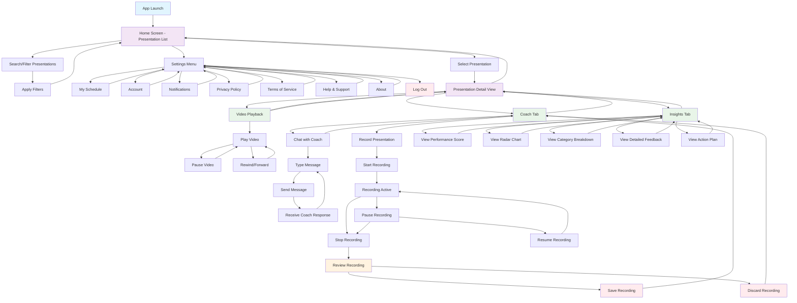

# User Interaction Flow Diagram

## Overview
This document outlines the complete user interaction flow for the SoloLevel mobile application based on the actual wireframe screens. The flow covers camera recording, AI analysis, feedback review, video history management, and AI coaching features.

## Flow Diagram



## Detailed User Flows

### 1. Main Screen - Camera View Flow
```
App Launch → Main Screen (Camera View)
├── Side Sheet Menu
│   ├── Videos List Screen
│   ├── Coaching Sessions List
│   └── Settings Screen
├── Start Recording
├── Upload Video
├── Coach Tab
└── Insights Tab
```

### 2. Recording Flow
```
Main Screen → Start Recording
├── Recording Active State
│   ├── Pause Recording
│   └── Stop Recording
├── Paused State
│   ├── Resume Recording
│   └── Stop Recording
└── Analysis Processing
    └── AI Processing with Spinner
        └── Feedback Review Screen
```

### 3. Side Sheet Menu Flow
```
Side Sheet Menu → Navigation Options
├── Videos List Screen
│   ├── Filter Screen
│   ├── Select Video from List
│   ├── Video Detail View
│   ├── Playback with Feedback
│   └── View AI Insights
├── Coaching Sessions List
└── Settings Screen
    ├── Account Settings
    ├── Personalisation
    ├── Give Feedback
    ├── Data Controls
    ├── Security
    ├── About
    └── Log Out
```

### 4. Feedback Review Flow
```
Analysis Complete → Feedback Review Screen
├── Video Playback with Overlay
├── View AI Feedback Timeline
├── View Performance Insights
├── Play/Pause Controls
└── Seek Timeline
```

### 5. Coach Interaction Flow
```
Coach Tab → Chat Interface
├── Chat Mode
│   ├── Type Message
│   ├── Send Message
│   └── Receive Avatar Response
└── Mirror Mode (Future)
```

### 6. Insights Tab Flow
```
Insights Tab → Performance Analysis
├── View Performance Score
├── View Radar Chart
├── View Category Breakdown
├── View Detailed Feedback
└── View Action Plan
```

### 7. Settings Management Flow
```
Side Sheet Menu → Settings Screen
├── Account Settings
├── Personalisation
├── Give Feedback
├── Data Controls
├── Security
├── About
└── Log Out
```

## Key Interaction Patterns

### Navigation Patterns
- **Side Sheet Navigation**: Single slide-out menu with Videos, Coaching Sessions, and Settings
- **Tab Navigation**: Coach tab with Chat/Mirror mode toggle and Insights tab
- **Back Navigation**: Consistent back arrow for hierarchical navigation
- **Modal Navigation**: Settings sub-screens and Filter overlay

### State Management
- **Recording States**: Idle → Active → Paused → Stopped → Analysis → Feedback
- **Playback States**: Stopped → Playing → Paused (with overlay controls)
- **Chat States**: Empty → Message Sent → Avatar Response
- **Analysis States**: Processing → Complete → Feedback Available

### User Actions
- **Primary Actions**: Record, Upload, Play, Send Message
- **Secondary Actions**: Pause, Stop, Seek, Filter
- **Navigation Actions**: Back, Side Sheet, Tab Switch

## Screen Transitions

### Immediate Transitions
- Start/Stop recording
- Play/Pause video controls
- Chat message sending

### Side Sheet Transitions
- Single side sheet menu slide-out
- Videos List Screen navigation
- Coaching Sessions List navigation
- Settings Screen navigation
- Filter overlay from Videos List

### Analysis Flow Transitions
- Recording → Analysis Processing → Feedback Review
- Upload → Analysis Processing → Feedback Review

## Error Handling Points
- Recording permission denied
- Video upload failures
- AI analysis processing errors
- Network connectivity issues
- Coach response failures

## Accessibility Considerations
- Voice-over support for all interactive elements
- High contrast mode compatibility
- Large touch targets for recording controls
- Screen reader friendly feedback messages
- Motion capture visualization accessibility
