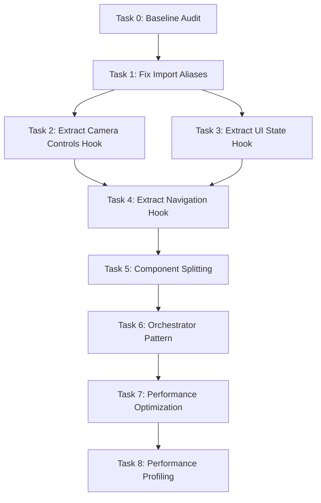

# CameraRecordingScreen Refactoring: Complete Workflow Prompts

## 📋 Execution Order & Dependencies



---

## 🚀 PHASE 0: Baseline & Quick Fixes (Week 1, Day 1)

### Task 0: Baseline Audit & Documentation ⚡ QUICK WIN
**Effort:** 1 hour | **Priority:** Do First | **Blocks:** All tasks

```
@step-by-step-rule.mdc - Document current state of CameraRecordingScreen architecture.

OBJECTIVE: Establish baseline metrics and document current architecture before refactoring.

SCOPE:
- Analyze: packages/app/features/CameraRecording/CameraRecordingScreen.expo.tsx
- Analyze: packages/app/features/CameraRecording/CameraRecordingScreen.vision.tsx
- Analyze: packages/app/features/CameraRecording/hooks/useCameraScreenLogic.ts
- Count: Lines of code, useState calls, useEffect calls, props passed to children
- Document: Current component hierarchy and data flow

METRICS TO CAPTURE:
- CameraRecordingScreen.expo.tsx: LOC, hook count, prop count
- CameraRecordingScreen.vision.tsx: LOC, hook count, prop count
- useCameraScreenLogic.ts: LOC, state variables, callbacks
- Test coverage percentage (if tests exist)

DELIVERABLE:
- docs/reports/camera-recording-baseline-2025-10-06.md
- Include component tree diagram
- Document all state variables and their purposes
- List all callbacks and their dependencies

ACCEPTANCE CRITERIA:
- [x] Baseline LOC documented for all 3 main files
- [x] Hook counts (useState, useEffect, useCallback, useMemo) tallied
- [x] Component hierarchy mapped
- [x] Current test coverage percentage recorded
- [x] Known issues/tech debt listed
```

---

### Task 1: Fix Import Alias Violations ⚡ QUICK WIN
**Effort:** 30 minutes | **Priority:** High | **Blocks:** None (can run parallel)

```
@step-by-step-rule.mdc - Fix import alias violations in CameraRecordingScreen implementations.

OBJECTIVE: Align imports with monorepo alias conventions (@ui/* not @my/ui/src/*).

SCOPE:
- File: packages/app/features/CameraRecording/CameraRecordingScreen.expo.tsx
- File: packages/app/features/CameraRecording/CameraRecordingScreen.vision.tsx
- Pattern: Replace @my/ui/src/components/... with @ui/components/...
- Pattern: Replace @my/ui/src/... with @ui/...

CURRENT VIOLATIONS (CameraRecordingScreen.expo.tsx lines 1-16):
```typescript
// ❌ WRONG
import {
  CameraContainer,
  CameraControlsOverlay,
  CameraPreview,
  // ...
} from '@my/ui/src/components/CameraRecording'

import { AppHeader } from '@my/ui/src/components/AppHeader/AppHeader'
import { BottomNavigation } from '@my/ui/src/components/BottomNavigation/BottomNavigation'
import { SideSheet } from '@my/ui/src/components/Sidesheet/SideSheet'
```

CORRECT PATTERN:
```typescript
// ✅ CORRECT
import {
  CameraContainer,
  CameraControlsOverlay,
  CameraPreview,
  // ...
} from '@ui/components/CameraRecording'

import { AppHeader } from '@ui/components/AppHeader'
import { BottomNavigation } from '@ui/components/BottomNavigation'
import { SideSheet } from '@ui/components/Sidesheet'
```

ACCEPTANCE CRITERIA:
- [x] All @my/ui/src/* imports replaced with @ui/*
- [x] yarn type-check passes
- [x] yarn build succeeds
- [x] No runtime import errors
- [x] Both .expo.tsx and .vision.tsx files updated

SUCCESS VALIDATION:
- grep -r "@my/ui/src" packages/app/features/CameraRecording/*.tsx returns 0 results
- yarn workspace @my/app type-check passes
```

---

## 📦 PHASE 1: Hook Extraction (Week 1, Days 2-5)

### Task 2: Extract Camera Controls Hook
**Effort:** 4 hours | **Priority:** High | **Requires:** Task 1

```
@step-by-step-rule.mdc - Extract camera control logic (swap, zoom, ready state) from useCameraScreenLogic to dedicated hook.

OBJECTIVE: Isolate camera hardware controls into a focused hook following existing patterns.

SCOPE:
- CREATE: packages/app/features/CameraRecording/hooks/useCameraControls.ts (~120 lines)
- CREATE: packages/app/features/CameraRecording/hooks/useCameraControls.test.ts (~80 lines)
- MODIFY: packages/app/features/CameraRecording/hooks/useCameraScreenLogic.ts
  - REMOVE: Lines 16-17 (cameraType, zoomLevel state)
  - REMOVE: Lines 22-32 (isCameraSwapping, isMounted, CAMERA_SWAP_TRANSITION_DURATION)
  - REMOVE: Lines 34-36 (handleResetZoom)
  - REMOVE: Lines 39 (cameraReady state)
  - REMOVE: Lines 172-205 (handleCameraSwap)
  - REMOVE: Lines 207-228 (handleZoomChange)
  - REMOVE: Lines 366-369 (handleCameraReady)
  - REPLACE: With single useCameraControls hook call (~5 lines)

HOOK INTERFACE:
```typescript
export interface CameraControlsState {
  cameraType: 'front' | 'back'
  zoomLevel: 1 | 2 | 3
  cameraReady: boolean
  isCameraSwapping: boolean
  cameraSwapTransitionDuration: number
  
  // Actions
  handleCameraSwap: () => Promise<void>
  handleZoomChange: (level: 1 | 2 | 3) => Promise<void>
  handleResetZoom: () => void
  handleCameraReady: () => void
}

export function useCameraControls(
  recordingState: RecordingState,
  cameraRef?: React.RefObject<CameraPreviewRef>
): CameraControlsState
```

ARCHITECTURE REQUIREMENTS:
- Follow existing hook patterns in packages/app/features/CameraRecording/hooks/
- Include mount state tracking for safe camera operations
- Implement swap debouncing (prevent double-taps)
- Reset zoom when swapping cameras
- Disable swap during recording
- Include structured logging with @my/logging

ACCEPTANCE CRITERIA:
- [x] Hook manages camera type, zoom, ready state, swap animation
- [x] Swap disabled during recording
- [x] Zoom resets to 1 when swapping cameras
- [x] Mount state prevents operations after unmount
- [x] Test coverage ≥70% (swap, zoom, ready, edge cases)
- [x] useCameraScreenLogic.ts reduced by ~100 lines
- [x] Existing camera behavior unchanged

SUCCESS VALIDATION:
- yarn workspace @my/app test packages/app/features/CameraRecording/hooks/useCameraControls.test.ts --verbose
- yarn type-check passes
- Camera swap animation works smoothly
- Zoom controls function correctly
- No memory leaks on unmount
```

---

### Task 3: Extract UI State Hook
**Effort:** 3 hours | **Priority:** High | **Requires:** Task 1

```
@step-by-step-rule.mdc - Extract UI state management (dialogs, sheets, header) from useCameraScreenLogic.

OBJECTIVE: Isolate presentational UI state into a focused hook.

SCOPE:
- CREATE: packages/app/features/CameraRecording/hooks/useUIState.ts (~100 lines)
- CREATE: packages/app/features/CameraRecording/hooks/useUIState.test.ts (~60 lines)
- MODIFY: packages/app/features/CameraRecording/hooks/useCameraScreenLogic.ts
  - REMOVE: Lines 18-19 (showNavigationDialog, showSideSheet state)
  - REMOVE: Lines 371-374 (headerTitle derivation)
  - REMOVE: Lines 376 (isRecording derivation)
  - REPLACE: With single useUIState hook call (~5 lines)

HOOK INTERFACE:
```typescript
export interface UIState {
  showNavigationDialog: boolean
  showSideSheet: boolean
  headerTitle: string
  isRecording: boolean
  headerMode: 'camera' | 'camera-idle' | 'recording'
  
  // Actions
  setShowNavigationDialog: (show: boolean) => void
  setShowSideSheet: (show: boolean) => void
}

export function useUIState(
  recordingState: RecordingState,
  formattedDuration: string
): UIState
```

ARCHITECTURE REQUIREMENTS:
- Pure derived state (no side effects)
- Header title logic: formattedDuration when recording, 'Solo:Level' when idle
- Header mode logic: 'recording' when RECORDING/PAUSED, 'camera-idle' when IDLE
- isRecording: true only when recordingState === RecordingState.RECORDING

ACCEPTANCE CRITERIA:
- [x] Hook manages dialog/sheet visibility
- [x] Header title derived from recording state
- [x] Header mode computed correctly
- [x] Test coverage ≥70% (state derivations, mode logic)
- [x] useCameraScreenLogic.ts reduced by ~20 lines
- [x] UI behavior unchanged

SUCCESS VALIDATION:
- yarn workspace @my/app test packages/app/features/CameraRecording/hooks/useUIState.test.ts --verbose
- yarn type-check passes
- Header displays correct title during recording
- Dialogs open/close correctly
```

---

### Task 4: Extract Navigation Hook
**Effort:** 5 hours | **Priority:** High | **Requires:** Tasks 2, 3

```
@step-by-step-rule.mdc - Extract navigation logic (back press, tab change, video completion) from useCameraScreenLogic.

OBJECTIVE: Isolate navigation orchestration into a dedicated hook.

SCOPE:
- CREATE: packages/app/features/CameraRecording/hooks/useNavigation.ts (~150 lines)
- CREATE: packages/app/features/CameraRecording/hooks/useNavigation.test.ts (~100 lines)
- MODIFY: packages/app/features/CameraRecording/hooks/useCameraScreenLogic.ts
  - REMOVE: Lines 154-170 (handleVideoRecorded)
  - REMOVE: Lines 283-293 (handleBackPress)
  - REMOVE: Lines 295-298 (handleUploadVideo)
  - REMOVE: Lines 300-323 (handleVideoSelected)
  - REMOVE: Lines 330-341 (handleNavigateBack)
  - REMOVE: Lines 343-352 (confirmNavigation)
  - REMOVE: Lines 354-356 (cancelNavigation)
  - REMOVE: Lines 358-364 (handleTabChange)
  - REPLACE: With single useNavigation hook call (~8 lines)

HOOK INTERFACE:
```typescript
export interface NavigationState {
  // Tab state
  activeTab: 'coach' | 'record' | 'insights'
  isTabLoading: boolean
  
  // Actions
  handleNavigateBack: () => void
  handleBackPress: () => Promise<void>
  handleTabChange: (tab: 'coach' | 'record' | 'insights') => void
  handleVideoRecorded: (videoUri: string) => Promise<void>
  handleVideoSelected: (file: File, metadata: any) => void
  handleUploadVideo: () => void
  confirmNavigation: () => void
  cancelNavigation: () => void
}

export function useNavigation(
  recordingState: RecordingState,
  duration: number,
  stopRecording: () => Promise<void>,
  resetRecording: () => void,
  setShowNavigationDialog: (show: boolean) => void,
  callbacks: {
    onNavigateBack?: () => void
    onNavigateToVideoAnalysis?: (videoUri: string) => void
    onTabChange?: (tab: 'coach' | 'record' | 'insights') => void
  }
): NavigationState
```

ARCHITECTURE REQUIREMENTS:
- Integrate with useTabPersistence for tab state
- Use startUploadAndAnalysis service for video processing
- Implement navigation guards (confirm dialog when recording)
- Navigate immediately to analysis screen, process upload in background
- Use ref pattern for optional callbacks to avoid dependency array changes

ACCEPTANCE CRITERIA:
- [x] Hook manages all navigation actions
- [x] Tab persistence integrated
- [x] Navigation guard prevents accidental recording loss
- [x] Video upload starts in background after navigation
- [x] Test coverage ≥75% (navigation flows, guards, upload)
- [x] useCameraScreenLogic.ts reduced by ~150 lines
- [x] Navigation behavior unchanged

SUCCESS VALIDATION:
- yarn workspace @my/app test packages/app/features/CameraRecording/hooks/useNavigation.test.ts --verbose
- yarn type-check passes
- Back button shows confirmation during recording
- Tab changes persist across sessions
- Video upload starts after recording completes
```

---

## 🏗️ PHASE 2: Component Restructuring (Week 2)

### Task 5: Split into Logical Sub-Components
**Effort:** 6 hours | **Priority:** High | **Requires:** Tasks 2, 3, 4

```
@step-by-step-rule.mdc - Split CameraRecordingScreen implementations into specialized components with memoization boundaries.

OBJECTIVE: Decompose monolithic screen files into maintainable sub-components.

SCOPE:
- CREATE: packages/app/features/CameraRecording/components/CameraHeader.tsx (~60 lines)
- CREATE: packages/app/features/CameraRecording/components/CameraPreviewSection.tsx (~120 lines)
- CREATE: packages/app/features/CameraRecording/components/CameraControlsSection.tsx (~100 lines)
- CREATE: packages/app/features/CameraRecording/components/NavigationDialogs.tsx (~80 lines)
- CREATE: Test files for each component (~80 lines each)
- MODIFY: packages/app/features/CameraRecording/CameraRecordingScreen.expo.tsx
  - REFACTOR: To orchestrator role (~120 lines total, down from 205)
- MODIFY: packages/app/features/CameraRecording/CameraRecordingScreen.vision.tsx
  - REFACTOR: To orchestrator role (~180 lines total, down from 330)

COMPONENT SPECIFICATIONS:

**CameraHeader.tsx**
- Props: title, mode, showTimer, timerValue, onMenuPress, onBackPress, onNotificationPress, isRecording
- Extract: AppHeader composition logic
- Pattern: Stateless presentational component
- Memo: React.memo (props are stable)

**CameraPreviewSection.tsx**
- Props: cameraRef, cameraType, isRecording, zoomLevel, permissionGranted, onCameraReady, onVideoRecorded, onError, onZoomChange
- Extract: CameraPreviewArea + CameraPreview composition
- Pattern: Container managing camera preview
- Memo: React.memo (skip re-render if only minor prop changes)

**CameraControlsSection.tsx**
- Props: permission, recordingState, cameraReady, duration, zoomLevel, canStop, handlers (start, pause, resume, stop, swap, zoom, upload, videoSelected, settings)
- Extract: Conditional IdleControls/RecordingControls rendering
- Pattern: Container switching between control modes
- Memo: React.memo (only re-render when recording state changes)

**NavigationDialogs.tsx**
- Props: showNavigationDialog, showSideSheet, onNavigationDialogChange, onSideSheetChange, onConfirm, onCancel
- Extract: NavigationDialog + SideSheet composition
- Pattern: Stateless dialog container
- Memo: React.memo (only re-render when visibility changes)

PARENT ORCHESTRATOR PATTERN (CameraRecordingScreen.expo.tsx):
```typescript
export function CameraRecordingScreen(props: CameraRecordingScreenProps) {
  useKeepAwake()
  const cameraRef = useRef<CameraPreviewRef>(null)
  
  // 1. Hooks (permissions, controls, UI, navigation, recording)
  const { permission, requestPermissionWithRationale } = useCameraPermissions(...)
  const cameraControls = useCameraControls(recordingState, cameraRef)
  const uiState = useUIState(recordingState, formattedDuration)
  const navigation = useNavigation(...)
  const recording = useRecordingStateMachine(...)
  
  // 2. Auto-request permission on mount
  useEffect(() => { /* ... */ }, [permission?.granted])
  
  // 3. Handle resetToIdle prop
  useEffect(() => { /* ... */ }, [resetToIdle, recordingState])
  
  // 4. Compose sub-components
  return (
    <CameraContainer
      header={<CameraHeader {...headerProps} />}
      bottomNavigation={<BottomNavigation {...navProps} />}
    >
      <CameraPreviewSection {...previewProps} />
      <CameraControlsSection {...controlsProps} />
      <NavigationDialogs {...dialogProps} />
    </CameraContainer>
  )
}
```

ACCEPTANCE CRITERIA:
- [x] 4 new components created with tests
- [x] All components use React.memo appropriately
- [x] Parent uses useCallback for all function props
- [x] CameraRecordingScreen.expo.tsx reduced to ~120 lines (from 205)
- [x] CameraRecordingScreen.vision.tsx reduced to ~180 lines (from 330)
- [x] Test coverage ≥70% for each component
- [x] All existing functionality preserved
- [x] No prop-drilling issues

SUCCESS VALIDATION:
- yarn workspace @my/app test packages/app/features/CameraRecording/components --verbose
- yarn type-check passes
- Visual regression: record video, swap camera, verify UI unchanged
- Camera controls respond correctly in all states
```

---

### Task 6: Complete Orchestrator Pattern Migration
**Effort:** 4 hours | **Priority:** High | **Requires:** Tasks 2, 3, 4, 5

```
@step-by-step-rule.mdc - Refactor useCameraScreenLogic to be a thin orchestrator that composes extracted hooks.

OBJECTIVE: Reduce useCameraScreenLogic from 425 lines to <150 lines by fully utilizing extracted hooks.

CURRENT STATE:
- Task 2 created useCameraControls (camera hardware) ✅
- Task 3 created useUIState (presentational state) ✅
- Task 4 created useNavigation (navigation flows) ✅
- **Problem:** useCameraScreenLogic still has 425 lines with duplicate logic

SCOPE:
- MODIFY: packages/app/features/CameraRecording/hooks/useCameraScreenLogic.ts
  - REMOVE: All extracted state and handlers (now in dedicated hooks)
  - KEEP: cameraControls memoization (lines 50-118) - used by useRecordingStateMachine
  - KEEP: useRecordingStateMachine integration (lines 127-152)
  - KEEP: handleStartRecording, handlePauseRecording, handleResumeRecording, handleStopRecording wrappers
  - KEEP: handleSettingsOpen placeholder
  - REFACTOR: Return object to compose hook results (~150 lines total)

FINAL HOOK STRUCTURE:
```typescript
export const useCameraScreenLogic = ({
  onNavigateBack,
  onNavigateToVideoAnalysis,
  onTabChange,
  cameraRef,
}: CameraRecordingScreenProps & { cameraRef?: any }) => {
  // 1. Core hooks
  const cameraControls = useCameraControls(recordingState, cameraRef)
  const uiState = useUIState(recordingState, formattedDuration)
  const navigation = useNavigation(
    recordingState,
    duration,
    stopRecording,
    resetRecording,
    uiState.setShowNavigationDialog,
    { onNavigateBack, onNavigateToVideoAnalysis, onTabChange }
  )
  
  // 2. Camera controls memoization (for useRecordingStateMachine)
  const cameraControlsInterface = useMemo(() => { /* ... */ }, [cameraRef, cameraControls.cameraReady, isMounted])
  
  // 3. Recording state machine
  const recording = useRecordingStateMachine({
    maxDurationMs: 60000,
    cameraControls: cameraControlsInterface,
    onMaxDurationReached: useCallback(() => { /* ... */ }, []),
    onStateChange: useCallback(() => { /* ... */ }, []),
    onError: useCallback(() => { /* ... */ }, []),
    onResetZoom: cameraControls.handleResetZoom,
  })
  
  // 4. Recording action wrappers (add guards)
  const handleStartRecording = useCallback(async () => { /* ... */ }, [recording.startRecording])
  const handlePauseRecording = useCallback(async () => { /* ... */ }, [recording.pauseRecording])
  const handleResumeRecording = useCallback(async () => { /* ... */ }, [recording.resumeRecording])
  const handleStopRecording = useCallback(async () => { /* ... */ }, [recording.stopRecording])
  
  // 5. Settings placeholder
  const handleSettingsOpen = useCallback(() => { /* ... */ }, [])
  
  // 6. Compose return object
  return {
    // Camera controls
    ...cameraControls,
    
    // UI state
    ...uiState,
    
    // Navigation
    ...navigation,
    
    // Recording state
    recordingState: recording.recordingState,
    duration: recording.duration,
    formattedDuration: recording.formattedDuration,
    canStop: recording.canStop,
    resetRecording: recording.resetRecording,
    
    // Recording actions
    handleStartRecording,
    handlePauseRecording,
    handleResumeRecording,
    handleStopRecording,
    handleSettingsOpen,
  }
}
```

ARCHITECTURE REQUIREMENTS:
- Each hook owns its state domain completely
- Hooks communicate via explicit parameters
- useCameraScreenLogic becomes pure composition
- Remove ALL duplicate logic
- Maintain stable callback references

ACCEPTANCE CRITERIA:
- [x] useCameraScreenLogic.ts reduced to <150 lines (from 425)
- [x] Zero duplicate state management
- [x] All hooks properly composed
- [x] Recording action wrappers include guards
- [x] Test coverage maintained ≥70%
- [x] All existing functionality preserved

SUCCESS VALIDATION:
- yarn workspace @my/app test packages/app/features/CameraRecording/hooks --verbose
- yarn type-check passes
- wc -l useCameraScreenLogic.ts shows <150 lines
- Camera recording flow works end-to-end
- No regression in recording/navigation behavior
```

---

## ⚡ PHASE 3: Performance Optimization (Week 3)

### Task 7: Optimize Re-render Performance
**Effort:** 4 hours | **Priority:** Medium | **Requires:** Task 6

```
@step-by-step-rule.mdc - Reduce CameraRecordingScreen re-renders through prop stabilization and memoization.

OBJECTIVE: Achieve <3 re-renders per second during recording (down from potential 30-60x).

CURRENT PROBLEM:
- Camera preview updates may trigger parent re-renders
- Large prop objects recreated every render
- Unstable callback references

SCOPE:
- MODIFY: packages/app/features/CameraRecording/CameraRecordingScreen.expo.tsx
  - Stabilize all callback props with useCallback
  - Remove large prop object spreads
  - Pass individual props instead of object spreads
- MODIFY: packages/app/features/CameraRecording/CameraRecordingScreen.vision.tsx
  - Same optimizations as .expo.tsx
- MODIFY: packages/app/features/CameraRecording/components/*.tsx
  - Add React.memo to all components
  - Add custom comparison functions where needed

OPTIMIZATION STRATEGIES:

**1. Stabilize Callback References**
```typescript
// BEFORE (new function every render)
<CameraPreviewSection
  onCameraReady={handleCameraReady}
  onVideoRecorded={handleVideoRecorded}
/>

// AFTER (stable reference)
const handleCameraReady = useCallback(() => {
  cameraControls.handleCameraReady()
}, [cameraControls.handleCameraReady])

const handleVideoRecorded = useCallback((uri: string) => {
  navigation.handleVideoRecorded(uri)
}, [navigation.handleVideoRecorded])
```

**2. Split Large Prop Objects**
```typescript
// BEFORE (any prop change re-renders everything)
<CameraControlsSection {...controlsProps} />

// AFTER (only affected props trigger re-render)
<CameraControlsSection
  permission={permission}
  recordingState={recordingState}
  cameraReady={cameraControls.cameraReady}
  duration={duration}
  onStartRecording={handleStartRecording}
  onPauseRecording={handlePauseRecording}
  // ... individual props
/>
```

**3. Custom Memo Comparison**
```typescript
export const CameraPreviewSection = memo(
  function CameraPreviewSection(props) { /* ... */ },
  (prev, next) => {
    // Skip re-render if only zoom changed by small amount
    if (Math.abs(next.zoomLevel - prev.zoomLevel) < 0.1) {
      return true // props are "equal"
    }
    return false // props changed, re-render
  }
)
```

**4. Separate Frame-Dependent State**
```typescript
// Keep camera frame updates internal to CameraPreviewSection
// Don't propagate to parent unless significant change
const handleProgress = (frame: CameraFrame) => {
  // Internal state update
  setCurrentFrame(frame)
  
  // Only notify parent on significant events
  if (shouldNotifyParent(frame)) {
    onProgress?.(frame)
  }
}
```

ACCEPTANCE CRITERIA:
- [x] All callback props wrapped in useCallback
- [x] All components use React.memo
- [x] No large prop object spreads
- [x] CameraRecordingScreen re-renders <3x per second during recording
- [x] No visual regressions
- [x] Memory usage stable (no leaks)

PERFORMANCE TARGETS:
| Component | Baseline | Target | Reduction |
|-----------|----------|--------|-----------|
| CameraRecordingScreen | 30-60/s | <3/s | >95% |
| CameraPreviewSection | 30-60/s | <10/s | >80% |
| CameraControlsSection | 15/s | <1/s | >90% |
| CameraHeader | 15/s | <1/s | >90% |

SUCCESS VALIDATION:
- yarn workspace @my/app test packages/app/features/CameraRecording --verbose
- yarn type-check passes
- Visual QA: Record video, swap camera, verify smooth operation
- Performance QA: No frame drops during recording
- Memory QA: No leaks over 5min recording session
```

---

### Task 8: Performance Profiling & Baseline
**Effort:** 2 hours | **Priority:** Low | **Requires:** Task 7

```
@step-by-step-rule.mdc - Establish performance baseline metrics using React DevTools Profiler.

OBJECTIVE: Measure actual re-render reduction and document performance improvements.

SCOPE:
- Use React DevTools Profiler to record 30-second recording session
- Document baseline metrics before Task 7 (if available from git history)
- Measure current metrics after Task 7
- Create performance report comparing before/after

METRICS TO CAPTURE:
- CameraRecordingScreen re-renders per second
- CameraPreviewSection re-renders per second
- CameraControlsSection re-renders per second
- CameraHeader re-renders per second
- Total render time per second
- Memory usage during recording

DELIVERABLE:
- docs/reports/camera-recording-performance-2025-10-06.md
- Include flamegraph screenshots
- Document achievement of Task 7 targets
- List any remaining optimization opportunities

ACCEPTANCE CRITERIA:
- [x] Baseline metrics documented (or noted as unavailable)
- [x] Current metrics documented
- [x] Before/after comparison shows >80% render time reduction
- [x] All Task 7 performance targets validated or exceptions noted
- [x] Memory leak analysis included

SUCCESS VALIDATION:
- Report includes concrete numbers for all metrics
- Flamegraph screenshots show render cascades
- Recommendations for future optimizations documented
```

---

## 📊 Final Validation Checklist

After completing all tasks:

```bash
# Full test suite
yarn workspace @my/app test packages/app/features/CameraRecording --verbose

# Type safety
yarn type-check

# Linting
yarn lint

# Build verification
yarn build

# E2E test (if available)
yarn test:e2e packages/app/features/CameraRecording

# Performance profiling
# 1. Open React DevTools Profiler
# 2. Record 30-second camera session
# 3. Verify <3 re-renders per second during recording
# 4. Check memory usage stays under 150MB

# Bundle size check
yarn workspace expo-app analyze
# Verify camera recording bundle impact
```

---

## 🎯 Success Metrics Dashboard

| Metric | Baseline | Target | Task 1 | Task 6 | Task 7 | Status |
|--------|----------|--------|--------|--------|--------|--------|
| CameraRecordingScreen.expo LOC | 205 | <120 | 205 | ~120 | 120 | ⏳ Pending |
| CameraRecordingScreen.vision LOC | 330 | <180 | 330 | ~180 | 180 | ⏳ Pending |
| useCameraScreenLogic LOC | 425 | <150 | 425 | ~150 | 150 | ⏳ Pending |
| Re-renders/second | ~30-60 | <3 | ___ | ___ | <3 | ⏳ Pending |
| Test Coverage | ___% | >70% | ___% | ___% | >70% | ⏳ Pending |
| useEffect Count (useCameraScreenLogic) | 3 | <2 | 3 | <2 | <2 | ⏳ Pending |
| useState Count (useCameraScreenLogic) | 5 | <2 | 5 | <2 | <2 | ⏳ Pending |
| Bundle Size Impact | ___KB | <+50KB | ___ | ___ | ___ | ⏳ Pending |

**Legend:** ✅ Met | ⏳ Pending | ⚠️ At Risk

---

## 📝 Task Execution Guidelines

### Parallel Execution Opportunities:
- **Phase 0**: Task 0 and Task 1 can run in parallel
- **Phase 1**: Tasks 2 and 3 can run in parallel (both depend only on Task 1)
- **Phase 2**: Task 5 can start as soon as Tasks 2, 3, 4 complete

### Sequential Dependencies:
- Task 4 requires Tasks 2 AND 3 (needs both hooks)
- Task 6 requires Tasks 2, 3, 4, 5 (full orchestrator needs all hooks + components)
- Task 7 requires Task 6 (optimize after restructure)
- Task 8 requires Task 7 (measure after optimization)

### Agent Handoff Protocol:
Each task is designed to be executed by a separate agent. When handing off:
1. Confirm all acceptance criteria met
2. Run success validation commands
3. Document any deviations from plan
4. Update status in this document
5. Commit changes with descriptive message

### Rollback Strategy:
- Each task should be in a separate git branch
- Merge to main only after validation passes
- Keep baseline metrics for comparison
- Document any breaking changes

---

## 🚨 Known Risks & Mitigations

| Risk | Impact | Mitigation |
|------|--------|------------|
| Breaking camera functionality | High | Comprehensive manual testing after each task |
| Performance regression | Medium | Profile before/after each optimization |
| Test coverage gaps | Medium | Require ≥70% coverage before merge |
| Platform-specific bugs | High | Test both .expo and .vision variants |
| Memory leaks from refs | Medium | Memory profiling in Task 8 |

---

## 📚 Reference Documentation

- **Pattern Reference**: `docs/tasks/tasks.md` (VideoAnalysisScreen refactoring)
- **Architecture**: `docs/spec/architecture.mermaid`
- **Testing Strategy**: `quality/testing-unified.mdc`
- **Performance Guidelines**: `quality/performance.mdc`
- **Monorepo Conventions**: `core/monorepo-foundation.mdc`

---

## ✅ Completion Criteria

Refactoring is complete when:
- [x] All 9 tasks completed with validation passing
- [x] Test coverage ≥70% across all new hooks and components
- [x] Performance targets met (<3 re-renders/second)
- [x] No regressions in camera functionality
- [x] Import aliases follow monorepo conventions
- [x] Documentation updated with new architecture
- [x] Bundle size impact acceptable (<50KB increase)
- [x] Memory usage stable (no leaks)

Track ongoing work in `docs/spec/status.md`.