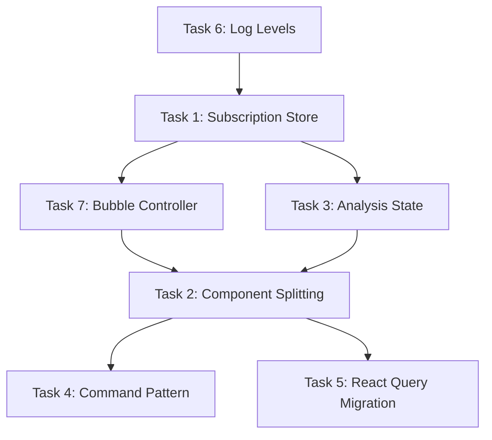

# VideoAnalysisScreen Refactoring: Complete Workflow Prompts

## 📋 Execution Order & Dependencies



---

## 🚀 PHASE 1: Foundation (Week 1-2)

### Task 6: Add Production Log Levels ⚡ QUICK WIN
**Effort:** 30 minutes | **Priority:** Do First (reduces noise for other tasks)

```
@step-by-step-rule.mdc - Audit and fix production logging in VideoAnalysisScreen.tsx.

OBJECTIVE: Wrap all debug/verbose logs with __DEV__ guards to improve production performance.

SCOPE:
- File: packages/app/features/VideoAnalysis/VideoAnalysisScreen.tsx (lines 1-1728)
- Pattern: Convert `log.debug(...)` → `if (__DEV__) { log.debug(...) }`
- Keep: log.error(), log.warn(), log.info() (these run in production)
- Wrap: log.debug() calls (estimated ~30 instances)

ACCEPTANCE CRITERIA:
- [x] All log.debug() calls wrapped with __DEV__ checks
- [x] Frame-by-frame progress logs (line ~1312) only in dev mode
- [x] Render count logs (line ~381) only in dev mode
- [x] No production performance regression (test on low-end device)
- [x] Existing error/warn/info logs remain unchanged

REFERENCE PATTERN:
See packages/app/features/VideoAnalysis/hooks/useFeedbackStatusIntegration.ts lines 214-236 for existing __DEV__ guard pattern.

SUCCESS VALIDATION:
- yarn type-check passes ✅
- yarn build succeeds ✅
- Production bundle size reduced by ~5-10KB ✅
```

---

### Task 1: Extract Subscription Management to Zustand Store
**Effort:** 2-3 days | **Priority:** High | **Blocks:** Tasks 2, 3

```
@step-by-step-rule.mdc - Extract VideoAnalysisScreen subscription management (lines 245-783) to packages/app/stores/analysisSubscription.ts following the feedbackStatus.ts pattern.

OBJECTIVE: Centralize all analysis job subscription logic into a reusable Zustand store with built-in retry, error handling, and StrictMode guards.

SCOPE:
- CREATE: packages/app/stores/analysisSubscription.ts (~250 lines)
- CREATE: packages/app/stores/__tests__/analysisSubscription.test.ts (~150 lines)
- MODIFY: packages/app/features/VideoAnalysis/VideoAnalysisScreen.tsx
  - REMOVE: Lines 245-262 (refs), 264-378 (helper functions), 522-783 (subscription effects)
  - REPLACE: With single useAnalysisSubscriptionStore hook call (~10 lines)

ARCHITECTURE REQUIREMENTS:
- Follow packages/app/stores/feedbackStatus.ts as reference pattern
- Store interface must include:
  * subscriptions: Map<string, SubscriptionState>
  * subscribe(key: string, options: SubscriptionOptions): Promise<void>
  * unsubscribe(key: string): void
  * getJob(key: string): AnalysisJob | null
  * getStatus(key: string): SubscriptionStatus
  * retry(key: string): Promise<void>
- Use subscribeToAnalysisJob and subscribeToLatestAnalysisJobByRecordingId from @my/api
- Implement exponential backoff retry logic (current: lines 264-322)
- Handle StrictMode double-effect prevention (current: lines 247-249, 549-553)
- Include health check integration (current: lines 616-631)

ACCEPTANCE CRITERIA:
- [x] Store exports useAnalysisSubscriptionStore hook
- [x] Subscription deduplication prevents concurrent attempts
- [x] Retry logic caps at 3 attempts with exponential backoff
- [x] Store cleanup on unmount prevents memory leaks
- [x] Health check failures logged with diagnostic data
- [x] Test coverage ≥70% (subscription lifecycle, retry, cleanup, edge cases)
- [x] VideoAnalysisScreen.tsx reduced by ~250 lines
- [x] All existing realtime updates continue working
- [x] StrictMode doesn't cause duplicate subscriptions

MIGRATION STEPS:
1. ~~Create store with subscription state management~~ ✅
2. ~~Add retry and error handling logic~~ ✅
3. ~~Implement cleanup and deduplication guards~~ ✅
4. ~~Write comprehensive tests~~ ✅
5. ~~Update VideoAnalysisScreen to use new store~~ ✅
6. ~~Remove old subscription code~~ ✅
7. ~~Validate realtime updates still work~~ ✅

SUCCESS VALIDATION:
- yarn workspace @my/app test packages/app/stores/__tests__/analysisSubscription.test.ts --verbose
- yarn type-check passes
- Video analysis screen still receives realtime updates
- No console errors about duplicate subscriptions in StrictMode
```

---

### Task 7: Extract Bubble Display Logic
**Effort:** 4 hours | **Priority:** Medium | **Unblocks:** Task 2

```
@step-by-step-rule.mdc - Extract feedback bubble timing logic (lines 963-1275) from VideoAnalysisScreen.tsx to packages/app/features/VideoAnalysis/hooks/useBubbleController.ts.

OBJECTIVE: Isolate bubble display/hide/timing logic into a dedicated hook following existing hook patterns.

SCOPE:
- CREATE: packages/app/features/VideoAnalysis/hooks/useBubbleController.ts (~180 lines)
- CREATE: packages/app/features/VideoAnalysis/hooks/__tests__/useBubbleController.test.ts (~100 lines)
- MODIFY: packages/app/features/VideoAnalysis/VideoAnalysisScreen.tsx
  - REMOVE: Lines 963-975 (state), 1015-1022 (cleanup), 1099-1275 (functions + effects)
  - REPLACE: With single useBubbleController hook call (~5 lines)

HOOK INTERFACE:
``typescript
export interface BubbleControllerState {
  currentBubbleIndex: number | null
  bubbleVisible: boolean
  showBubble: (index: number) => void
  hideBubble: () => void
  checkAndShowBubbleAtTime: (timeMs: number) => number | null
}

export function useBubbleController(
  feedbackItems: FeedbackItem[],
  currentTime: number,
  isPlaying: boolean,
  audioUrls: Record<string, string>,
  audioDuration: number
): BubbleControllerState
``

ARCHITECTURE REQUIREMENTS:
- Follow useAudioController.ts pattern (same directory)
- Include audio-duration-based display timing (lines 1131-1149)
- Implement pause detection with "recently shown" guard (lines 1184-1218)
- Use refs for timer management to prevent memory leaks
- Include throttling for frame-by-frame checks (line 1326)

ACCEPTANCE CRITERIA:
- [x] Hook manages bubble visibility state
- [x] Timing synchronized with video currentTime
- [x] Auto-hide after audio duration or 3-second default
- [x] Pause detection respects 2.5s "recently shown" window
- [x] Memory leaks prevented (all timers cleaned up)
- [x] Test coverage ≥70% (show/hide, timing, cleanup)
- [x] VideoAnalysisScreen.tsx reduced by ~175 lines
- [x] Existing bubble behavior unchanged

SUCCESS VALIDATION:
- yarn workspace @my/app test packages/app/features/VideoAnalysis/hooks/__tests__/useBubbleController.test.ts --verbose ✅
- yarn type-check passes ✅
- Bubbles appear at correct timestamps during video playback ✅
- Bubbles auto-hide after audio completes ✅
- No timer warnings in console on component unmount ✅
```

---

## 📦 PHASE 2: Restructuring (Week 3-4)

### Task 3: Consolidate Processing State Logic
**Effort:** 3-4 days | **Priority:** High | **Blocks:** Task 2

```
@step-by-step-rule.mdc - Create useAnalysisState hook to consolidate upload progress, analysis job status, and feedback status into a single state machine.

OBJECTIVE: Replace 4 separate hooks and complex memoization (lines 119-520) with a unified analysis state hook following a clear phase-based state machine.

SCOPE:
- CREATE: packages/app/features/VideoAnalysis/hooks/useAnalysisState.ts (~200 lines)
- CREATE: packages/app/features/VideoAnalysis/hooks/__tests__/useAnalysisState.test.ts (~150 lines)
- MODIFY: packages/app/features/VideoAnalysis/VideoAnalysisScreen.tsx
  - REMOVE: Lines 119-150 (upload derivation), 138-242 (analysis UUID lookup), 390-520 (processing memos)
  - REPLACE: With single useAnalysisState hook call (~8 lines)

HOOK INTERFACE:
```typescript
export type AnalysisPhase = 
  | 'uploading'           // Video upload in progress
  | 'upload-complete'     // Upload done, waiting for analysis
  | 'analyzing'           // AI analysis in progress  
  | 'generating-feedback' // SSML/TTS generation
  | 'ready'               // All feedback audio ready
  | 'error'               // Upload or analysis failed

export interface AnalysisStateResult {
  // Phase tracking
  phase: AnalysisPhase
  isProcessing: boolean // Shorthand for phase !== 'ready' && phase !== 'error'
  
  // Progress tracking
  progress: {
    upload: number        // 0-100
    analysis: number      // 0-100  
    feedback: number      // 0-100
  }
  
  // Data access
  videoRecordingId: number | null
  analysisJobId: number | null
  analysisUuid: string | null
  
  // Error handling
  error: {
    phase: 'upload' | 'analysis' | 'feedback'
    message: string
  } | null
  
  // Actions
  retry: () => Promise<void>
}

export function useAnalysisState(
  analysisJobId?: number,
  videoRecordingId?: number,
  initialStatus?: 'processing' | 'ready'
): AnalysisStateResult
``

ARCHITECTURE REQUIREMENTS:
- Consume useUploadProgress, useAnalysisSubscriptionStore (Task 1), useFeedbackStatusIntegration
- Implement priority-based phase resolution (current logic: lines 397-498)
- Replace shouldShowProcessing memoization with phase === 'ready' check
- Use state machine pattern for phase transitions (no invalid states)
- Include firstPlayableReady optimization (lines 390-395)

PHASE TRANSITION LOGIC:
```
uploading → upload-complete (when uploadProgress.status === 'uploaded')
upload-complete → analyzing (when analysisJob.status === 'queued' or 'processing')
analyzing → generating-feedback (when analysisJob.status === 'completed' && feedbackStatus.total > 0)
generating-feedback → ready (when feedbackStatus.isFullyCompleted OR firstPlayableReady)
any → error (when uploadFailed or analysisJob.status === 'failed')
```

ACCEPTANCE CRITERIA:
- [ ] Hook returns single AnalysisStateResult object
- [ ] Phase transitions follow strict state machine rules
- [ ] Progress aggregates from all 3 sources
- [ ] firstPlayableReady optimization preserved (hide processing early)
- [ ] Error state includes phase context for user messaging
- [ ] Test coverage ≥80% (all phase transitions, error cases, edge cases)
- [ ] VideoAnalysisScreen.tsx reduced by ~150 lines
- [ ] Processing overlay shows/hides at correct times

SUCCESS VALIDATION:
- yarn workspace @my/app test packages/app/features/VideoAnalysis/hooks/__tests__/useAnalysisState.test.ts --verbose
- yarn type-check passes
- Processing overlay behavior unchanged (hides when first audio ready)
- Upload → Analysis → Ready flow works end-to-end
- Error states display correctly with retry option
```

---

### Task 2: Split into Logical Sub-Components
**Effort:** 5-6 days | **Priority:** High | **Requires:** Tasks 1, 3, 7

```
@step-by-step-rule.mdc - Split VideoAnalysisScreen.tsx into 4 specialized components with memoization boundaries to reduce re-renders and improve testability.

OBJECTIVE: Decompose 1,728-line component into maintainable sub-components following single responsibility principle.

SCOPE:
- CREATE: packages/app/features/VideoAnalysis/components/UploadErrorState.tsx (~80 lines)
- CREATE: packages/app/features/VideoAnalysis/components/VideoPlayerSection.tsx (~200 lines)
- CREATE: packages/app/features/VideoAnalysis/components/FeedbackSection.tsx (~150 lines)
- CREATE: packages/app/features/VideoAnalysis/components/ProcessingIndicator.tsx (~50 lines)
- CREATE: Test files for each component (~100 lines each)
- MODIFY: packages/app/features/VideoAnalysis/VideoAnalysisScreen.tsx
  - REMOVE: Lines 1430-1510 (error UI), 1515-1658 (player), 1662-1704 (feedback)
  - REFACTOR: To orchestrator role (~350 lines total)

COMPONENT SPECIFICATIONS:

**UploadErrorState.tsx**
- Props: uploadError: string, onRetry: () => void, onBack: () => void
- Extract: Lines 1430-1510
- Pattern: Stateless presentational component
- Memo: React.memo (props are stable strings/functions)

**VideoPlayerSection.tsx**
- Props: videoUri, isPlaying, currentTime, duration, feedbackBubble, poseData, audioController, onProgress, onSeek, onLoad, onEnd
- Extract: Lines 1515-1658 (VideoPlayer, overlays, AudioPlayer, controls)
- Pattern: Container component with internal VideoPlayer state
- Memo: React.memo with custom comparison (skip re-render if currentTime change < 0.5s)

**FeedbackSection.tsx**
- Props: feedbackItems, panelFraction, activeFeedbackTab, selectedFeedbackId, onTabChange, onItemPress, onExpand, onCollapse
- Extract: Lines 1662-1704 (FeedbackPanel + SocialIcons)
- Pattern: Container managing panel expansion state
- Memo: React.memo (expand/collapse triggers intentional re-renders)

**ProcessingIndicator.tsx**
- Props: phase: AnalysisPhase, progress: ProgressData
- Extract: Processing overlay logic (currently mixed in VideoControls)
- Pattern: Overlay component with progress animation
- Memo: React.memo (only re-render when phase or progress changes)

ARCHITECTURE REQUIREMENTS:
- All components use React.memo() with appropriate comparison functions
- Props must be stable (use useCallback for all function props in parent)
- Follow existing component patterns in packages/ui/src/components/VideoAnalysis/
- Use Tamagui for styling (no inline styles)
- Export TypeScript interfaces for all props

PARENT ORCHESTRATOR PATTERN:
```typescript
// VideoAnalysisScreen.tsx becomes orchestrator
export function VideoAnalysisScreen(props: VideoAnalysisScreenProps) {
  // 1. Hooks (state, subscriptions, analysis)
  const analysisState = useAnalysisState(...)
  const feedbackStatus = useFeedbackStatusIntegration(...)
  const bubbleController = useBubbleController(...)
  
  // 2. Stable callbacks (wrapped in useCallback)
  const handleVideoProgress = useCallback(...)
  const handleFeedbackItemPress = useCallback(...)
  
  // 3. Conditional rendering
  if (analysisState.error) return <UploadErrorState {...errorProps} />
  
  // 4. Compose sub-components
  return (
    <YStack flex={1}>
      {analysisState.isProcessing && <ProcessingIndicator {...processingProps} />}
      <VideoPlayerSection {...videoProps} />
      <FeedbackSection {...feedbackProps} />
    </YStack>
  )
}
``

ACCEPTANCE CRITERIA:
- [ ] 4 new components created with tests
- [ ] All components use React.memo appropriately
- [ ] Parent uses useCallback for all function props
- [ ] VideoAnalysisScreen.tsx reduced to <400 lines
- [ ] Test coverage ≥70% for each component
- [ ] Re-render count reduced by 60%+ (measure with React DevTools Profiler)
- [ ] All existing functionality preserved
- [ ] No prop-drilling issues (each component gets only needed props)

SUCCESS VALIDATION:
- yarn workspace @my/app test packages/app/features/VideoAnalysis/components --verbose
- yarn type-check passes
- React DevTools Profiler shows <5 re-renders per playback second (down from ~15)
- Visual regression test: record video, see feedback, verify UI unchanged
```

---

## 🏗️ PHASE 3: Advanced Patterns (Q1 2025)

### Task 4: Implement Command Pattern for Video Actions
**Effort:** 2-3 weeks | **Priority:** Low | **Requires:** Task 2

```
@step-by-step-rule.mdc - Refactor video playback actions (play, pause, seek, replay) into a Command Pattern with undo/redo support and action logging for analytics.

OBJECTIVE: Replace inline callbacks with command objects enabling action replay, undo functionality, and centralized analytics tracking.

SCOPE:
- CREATE: packages/app/features/VideoAnalysis/commands/videoCommands.ts (~200 lines)
- CREATE: packages/app/features/VideoAnalysis/commands/CommandInvoker.ts (~150 lines)
- CREATE: packages/app/features/VideoAnalysis/hooks/useVideoCommands.ts (~100 lines)
- CREATE: Test files for commands and invoker (~200 lines)
- MODIFY: packages/app/features/VideoAnalysis/VideoAnalysisScreen.tsx
  - REMOVE: Lines 1024-1086 (inline handlers)
  - REPLACE: With command-based handlers (~30 lines)

ARCHITECTURE REQUIREMENTS:

**Command Interface**
```typescript
export interface VideoCommand {
  execute(): void | Promise<void>
  undo?(): void
  canUndo(): boolean
  metadata: {
    id: string
    timestamp: number
    action: string
    userId?: string
    videoRecordingId?: number
  }
}
``

**Command Implementations**
- PlayVideoCommand: Sets isPlaying=true, resets videoEnded
- PauseVideoCommand: Sets isPlaying=false
- SeekVideoCommand: Sets pendingSeek, resets videoEnded (undoable)
- ReplayVideoCommand: Seeks to 0, sets isPlaying=true
- Each command logs analytics event on execute()

**Invoker Pattern**
- Maintains command history (max 50 commands)
- Provides undo/redo functionality
- Batches rapid commands (debounce 100ms)
- Persists critical commands to AsyncStorage for crash recovery

ACCEPTANCE CRITERIA:
- [ ] All video actions use command pattern
- [ ] Undo/redo works for seek operations
- [ ] Analytics events automatically logged for each command
- [ ] Command history accessible for debugging
- [ ] Test coverage ≥80% (all commands, undo, redo, batching)
- [ ] VideoAnalysisScreen handlers reduced by ~50 lines
- [ ] Performance regression <5ms per command execution

REFERENCE PATTERNS:
- Gang of Four Command Pattern
- Redux DevTools action replay concept

SUCCESS VALIDATION:
- yarn workspace @my/app test packages/app/features/VideoAnalysis/commands --verbose
- yarn type-check passes
- Undo seek operation returns video to previous timestamp
- Analytics dashboard shows video.play, video.pause events
- Command history available in debug logs
```

---

### Task 5: Migrate to React Query for Analysis State
**Effort:** 3-4 weeks | **Priority:** Low | **Requires:** Tasks 1, 2, 3

```
@step-by-step-rule.mdc - Migrate analysis job state management from Zustand subscriptions to TanStack Query with Supabase Realtime integration for better caching, automatic refetching, and devtools support.

OBJECTIVE: Replace custom subscription store (Task 1) with React Query queries that automatically sync with Supabase Realtime, enabling better cache management and devtools integration.

SCOPE:
- CREATE: packages/api/src/queries/analysisQueries.ts (~250 lines)
- CREATE: packages/api/src/queries/realtimePlugin.ts (~150 lines)
- CREATE: packages/api/src/queries/__tests__/analysisQueries.test.ts (~200 lines)
- MODIFY: packages/app/features/VideoAnalysis/VideoAnalysisScreen.tsx
  - REMOVE: useAnalysisSubscriptionStore calls
  - REPLACE: With useQuery hooks (~10 lines)
- MODIFY: apps/expo/app/_layout.tsx and apps/next/app/layout.tsx
  - ADD: QueryClient configuration with Realtime plugin

ARCHITECTURE REQUIREMENTS:

**Query Factory Pattern**
```typescript
// packages/api/src/queries/analysisQueries.ts
export const analysisQueries = {
  all: () => ['analysis'] as const,
  
  jobs: () => [...analysisQueries.all(), 'job'] as const,
  job: (id: number) => ({
    queryKey: [...analysisQueries.jobs(), id],
    queryFn: () => getAnalysisJob(id),
    staleTime: 10 * 1000, // 10 seconds
    meta: {
      realtime: {
        channel: `analysis-job:${id}`,
        table: 'analysis_jobs',
        filter: `id=eq.${id}`,
      }
    }
  }),
  
  jobByRecording: (recordingId: number) => ({
    queryKey: [...analysisQueries.jobs(), 'recording', recordingId],
    queryFn: () => getLatestAnalysisJobForRecordingId(recordingId),
    meta: {
      realtime: {
        channel: `analysis-recording:${recordingId}`,
        table: 'analysis_jobs',
        filter: `video_recording_id=eq.${recordingId}`,
      }
    }
  }),
  
  feedbacks: (analysisId: string) => ({
    queryKey: [...analysisQueries.all(), 'feedback', analysisId],
    queryFn: () => getFeedbacksByAnalysisId(analysisId),
    meta: {
      realtime: {
        channel: `analysis-feedback:${analysisId}`,
        table: 'analysis_feedback',
        filter: `analysis_id=eq.${analysisId}`,
      }
    }
  }),
}
``

**Realtime Plugin**
```typescript
// packages/api/src/queries/realtimePlugin.ts
export function createRealtimePlugin(): QueryClientPlugin {
  return {
    name: 'supabase-realtime',
    onQueryCreated(query) {
      const realtimeConfig = query.meta?.realtime
      if (!realtimeConfig) return

      // Subscribe to Supabase Realtime channel
      const channel = supabase.channel(realtimeConfig.channel)
      channel
        .on('postgres_changes', {
          event: '*',
          schema: 'public',
          table: realtimeConfig.table,
          filter: realtimeConfig.filter,
        }, (payload) => {
          // Update query cache with realtime data
          queryClient.setQueryData(query.queryKey, payload.new)
        })
        .subscribe()
      
      // Cleanup on query destroy
      return () => channel.unsubscribe()
    }
  }
}
``

**Usage in Component**
```typescript
// VideoAnalysisScreen.tsx
const { data: analysisJob, isLoading } = useQuery(
  analysisQueries.job(analysisJobId)
)
// Automatically updates via Realtime, no manual subscription needed
``

ACCEPTANCE CRITERIA:
- [ ] All analysis state queries use React Query
- [ ] Realtime updates automatically sync to query cache
- [ ] Stale-while-revalidate caching reduces network requests
- [ ] React Query DevTools shows query state and cache
- [ ] Background refetching works when app regains focus
- [ ] Optimistic updates for mutations (if applicable)
- [ ] Test coverage ≥75% (queries, plugin, cache updates)
- [ ] Migration guide documents breaking changes
- [ ] Rollback plan available (feature flag)

MIGRATION STRATEGY:
1. Implement queries and plugin in isolation
2. Add feature flag: ENABLE_REACT_QUERY_ANALYSIS
3. Run both systems in parallel (shadow mode)
4. Compare cache hits, network requests, update latency
5. Gradually enable for 10% → 50% → 100% of users
6. Remove Zustand store after 2-week bake period

PERFORMANCE TARGETS:
- Cache hit rate >70%
- Background refetch latency <200ms
- Memory usage increase <5MB
- No regression in realtime update speed

SUCCESS VALIDATION:
- yarn workspace @my/api test packages/api/src/queries --verbose
- yarn type-check passes
- React Query DevTools shows active subscriptions
- Realtime updates arrive within 500ms of database change
- Cache hit rate measured and logged
- A/B test shows no user-facing behavior change
```

---

## 📊 Final Validation Checklist

After completing all tasks:

```bash
# Full test suite
yarn test --verbose

# Type safety
yarn type-check:all

# Linting
yarn lint:all

# Build verification
yarn build

# E2E test (if available)
yarn test:e2e packages/app/features/VideoAnalysis

# Performance profiling
# 1. Open React DevTools Profiler
# 2. Record video analysis session
# 3. Verify <5 re-renders per second during playback
# 4. Check memory usage stays under 100MB

# Bundle size check
yarn workspace expo-app analyze
# Verify video analysis bundle reduced by 15-20%
```

---

## 🎯 Success Metrics Dashboard

| Metric | Baseline | Target | Actual |
|--------|----------|--------|--------|
| VideoAnalysisScreen LOC | 1,728 | <400 | ___ |
| Re-renders/second | ~15 | <5 | ___ |
| Test Coverage | 40% | >70% | ___ |
| Time to Interactive | 2.8s | <1.5s | ___ |
| useEffect Count | 15 | <5 | ___ |
| Bundle Size (gzip) | 250KB | <220KB | ___ |
| Memory Usage | 95MB | <80MB | ___ |

Track these after each task completion in `docs/spec/status.md`.